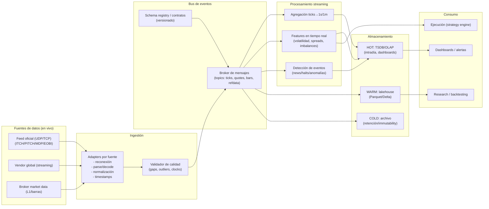

# Diseño e implementación de un sistema global de monitoreo y ejecución bursátil en tiempo real con R o Python

## Resumen ejecutivo

Un sistema **mundial** de monitoreo y ejecución bursátil “en tiempo real” es, en práctica, **dos sistemas acoplados**: (1) una **tubería de datos** con ingestión, normalización, almacenamiento y analítica de baja latencia; y (2) una **tubería de ejecución** (OMS/EMS) con conectividad de brokers/venues, controles de riesgo, auditoría y observabilidad. El cuello de botella rara vez es “el modelo” y casi siempre es **la correcta ingeniería de datos + la disciplina operativa** (pacing, reconexiones, sincronización de reloj, idempotencia, control de versiones de esquemas, y trazabilidad). citeturn9search3turn10search12turn10search3

Para un alcance global, la recomendación técnica más robusta (y realista) es un enfoque **híbrido**:

- **Datos**: priorizar **feeds oficiales/de bolsa** cuando el caso lo exige (microestructura, L2/L3, latencia mínima, book reconstruction), pero complementar o incluso reemplazar por **vendors globales normalizados** cuando el objetivo es cobertura multi-mercado, menor complejidad contractual y rapidez de salida a producción. (Ejemplos de vendors globales: B-PIPE, Real-Time, ICE Consolidated Feed). citeturn4search0turn4search13turn4search15turn0search33turn1search4turn1search9turn1search6turn17search1
- **Arquitectura**: separación estricta entre **data plane** (streaming + almacenamiento hot/warm/cold) y **execution plane** (señales → risk → órdenes → broker → fills), con colas/eventos como “contrato” entre dominios. citeturn9search3turn10search3turn10search12
- **Ejecución**: usar brokers con **cobertura global** y canales profesionales (REST + APIs nativas + FIX) cuando el caso lo amerite; tratar FIX como un proyecto de integración serio (certificación, pruebas, y operación). citeturn6search0turn6search4turn13search3
- **Operación y cumplimiento**: diseñar desde el día 1 para auditoría y retención (p. ej., los marcos de recordkeeping como SEC 17a‑4, o exigencias equivalentes en otras jurisdicciones), y observabilidad (métricas/alertas/trazas). citeturn12search0turn10search5turn11search0

El roadmap recomendado es por fases (MVP → piloto controlado → producción con SLA), con hitos medibles en: cobertura de mercados, latencia/end-to-end, calidad de datos, robustez de reconexión/replay, simulación/paper trading, controles de riesgo, y auditoría.

## Alcance, supuestos y criterios de diseño

### Supuestos explícitos por omisión del enunciado

Como no se especifican presupuesto, mercados, brokers permitidos, ni horizonte de inversión, haré supuestos “razonables” (y los marcaré como tales):

- **Activos**: acciones/ETFs y, opcionalmente, derivados listados (según disponibilidad del broker y del feed). citeturn6search3turn6search7  
- **Objetivo de latencia**: **“tiempo real operativo”** (decenas a cientos de milisegundos desde tick hasta señal/alerta), no necesariamente HFT sub‑milisegundo (que normalmente requiere co‑location, hardware especializado y contratos de datos más exigentes). citeturn2search5turn2search3turn2search4  
- **Usuarios**: 1–20 usuarios internos al inicio (impacta licencias/entitlements). citeturn4search19turn0search37  
- **Alcance geográfico**: al menos EE. UU., Europa (Reino Unido/UE) y Japón como “tríada” típica para probar complejidad de husos horarios, subastas y ventanas de operación. citeturn14search0turn17search1turn14search3  

### Qué significa “en tiempo real” en este contexto

En finanzas, “real-time” puede referirse a tres capas con implicancias muy distintas:

1. **Tiempo real de visualización** (dashboards y alertas): L1/Top-of-book + barras de 1s/1m suele bastar en muchos casos. citeturn11search1turn3search8  
2. **Tiempo real de analítica** (features, eventos y scoring): requiere streaming con semánticas claras de reintento/duplicación. citeturn10search12turn10search3  
3. **Tiempo real de ejecución** (señal→orden): exige controles de riesgo, manejo de estados de órdenes, y tolerancia a fallas de red/broker. citeturn13search1turn6search2turn6search0  

### Criterios de éxito medibles

Un diseño riguroso se gobierna por KPIs operativos (no solo PnL):

- **Data freshness** p50/p95/p99 por mercado (ms) y % de gaps/replays.
- **Ejecución**: tasa de rechazos, slippage vs benchmark, fill ratio.
- **Riesgo**: exposiciones y drawdowns vs límites, “kill-switch time”.
- **Confiabilidad**: RPO/RTO, éxito de failover, tasa de incidentes.
- **Auditoría**: completitud de logs/trails (señal→orden→fill). citeturn12search0turn11search0turn10search2  

## Datos de mercado globales: fuentes, granularidad, horarios, latencia, costos y licencias

### Fuentes: feeds oficiales vs vendors globales

**Feeds oficiales/de bolsa** (prioridad #1 por tu criterio) son la ruta “más pura” pero implican:
- múltiples protocolos (ITCH/PITCH/EOBI/MDP, multicast UDP, recovery),
- contratos por bolsa,
- reporting de uso/entitlements,
- y (a menudo) conectividad en data centers específicos. citeturn0search33turn1search0turn1search6turn1search9turn2search5turn2search3turn17search1  

Ejemplos de documentación primaria de feeds (muy usados en industria):
- entity["company","Nasdaq","us exchange operator"]: especificaciones ITCH/TotalView (direct feed de profundidad) a través de documentación publicada. citeturn0search36  
- entity["company","New York Stock Exchange","us stock exchange"]: descripción de “Integrated Feed” como vista order‑by‑order del mercado. citeturn0search33turn2search4  
- entity["company","Cboe Global Markets","global exchange operator"]: especificación Multicast PITCH (Depth of Book) y cláusulas de licenciamiento/redistribución. citeturn1search0turn1search24  
- entity["company","CME Group","us derivatives exchange group"]: MDP 3.0 como plataforma low‑latency e interfaces/formatos (SBE/FIX). citeturn1search9turn1search25  
- entity["company","Eurex","derivatives exchange"] (plataforma T7): manual EOBI con notas operativas (p. ej., no backward compatibility entre releases). citeturn1search6  
- entity["company","London Stock Exchange","uk stock exchange"]: documentos técnicos con horarios de sesiones y estructura (subastas, trading continuo). citeturn17search1turn15view0  
- entity["company","Japan Exchange Group","japan exchange group"]: servicios de datos (incl. históricos tipo “tick” provistos como PCAP) y reglas horarias. citeturn1search11turn14search3  

**Vendors globales** (prioridad #2) reducen fricción (una API, normalización, y soporte) y a veces permiten despliegue cloud:
- entity["company","Bloomberg","financial data vendor"] – B‑PIPE (Market Data Feed) para datos normalizados en tiempo real y entrega cloud. citeturn4search0turn4search24turn4search16  
- entity["company","Refinitiv","financial data vendor"] (ecosistema LSEG) – Real‑Time / RTSDK (pub/sub; despliegue on‑prem o cloud) y RDP APIs. citeturn4search13turn4search21turn4search5turn4search25  
- entity["company","ICE Data Services","market data vendor"] – ICE Consolidated Feed (agrega cientos de fuentes normalizadas). citeturn4search15turn4search7  
- entity["company","FactSet","financial data vendor"] – suite de real‑time data; incluso ofrece feed vía Kafka (relevante para ingestión). citeturn4search2turn4search30turn4search26  
- entity["company","SIX Group","swiss exchange group"] – servicios/feeds de mercado y “exchange feeds” desde SIX. citeturn4search35  

### Granularidad: tick vs barras (1s/1m) y qué “pierdes” al agregar

**Tick / event-by-event** (trades + quotes; idealmente L2/L3) es imprescindible si necesitas:
- reconstrucción de libro (order book reconstruction),
- microestructura (impacto, order flow, queue position),
- ejecución sensitiva a spread/imbalances,
- market replay fiel. citeturn0search33turn1search0turn1search6turn1search9turn1search11  

Ejemplo altamente “primario”: JPX indica que su histórico FLEX puede entregarse como **PCAP con timestamps de recepción**, útil para análisis detallado y backtesting. citeturn1search11turn1search19  

**Barras de 1 minuto (o 1 segundo)** son convenientes para:
- monitoreo e inversión “semi‑discrecional” o systematic de baja/mediana frecuencia,
- ML con features de OHLCV,
- reducción drástica de almacenamiento y complejidad.

La contracara: al agregarse, se pierde información de **secuencia intrabar**, dinámica bid/ask y colas, lo que introduce sesgos de backtest (p. ej., “bar‑based fill assumptions”).

### Horarios de mercado y “market hours engine”

Un sistema global necesita un “motor de horarios” que incorpore:
- husos horarios y cambios estacionales,
- feriados por mercado,
- subastas (open/close) y pausas (como el break en Japón),
- y sesiones extendidas si tu broker lo permite.

Ejemplos primarios (para calibrar diseño):

- NYSE detalla sesiones (pre‑opening/early/core/late) y subastas (open/close) para varios venues. citeturn14search0turn14search4  
- Nasdaq publica horas de trading (apertura/cierre) y (recientemente) documentos sobre expansión/operación extendida. citeturn14search1turn14search8turn14search12  
- JPX muestra sesiones “Morning/Afternoon” (con pausa) para cash equities. citeturn14search3  
- LSE (Millennium) tiene documentación técnica con secuencia de sesiones (pre‑trading, opening auction, trading continuo, closing auction). citeturn17search1turn15view0  

Nota forward‑looking: en EE. UU. hay movimientos hacia trading casi 24x5 (p. ej., propuestas públicas reportadas). Esto sugiere que tu motor de horarios debe ser **configurable** y no “hardcodeado”. citeturn14news37turn14news27turn14search8  

### Latencia, infraestructura y co‑location

La latencia no es un número único; es una cadena: feed → decodificación → bus → features → señal → risk → broker → venue. Para latencias muy bajas suele requerirse presencia en data centers financieros y conectividad especializada.

- entity["company","Equinix","data center operator"] opera data centers emblemáticos (p. ej., NY11/LD4) usados por ecosistemas financieros. citeturn2search1turn2search2turn2search18  
- Nasdaq describe su oferta de co‑location para proximidad a mercados. citeturn2search5turn2search13  
- Deutsche Börse indica el data center de co‑location (FR2) donde residen back‑ends primarios de Eurex y Xetra. citeturn2search3  
- ICE/NYSE publica especificaciones técnicas de conectividad/co‑location y redes de baja latencia. citeturn2search0turn2search4  

image_group{"layout":"carousel","aspect_ratio":"16:9","query":["Equinix NY11 data center Carteret","Equinix LD4 Slough data center","Equinix FR2 Frankfurt data center","NYSE Mahwah data center colocation"],"num_per_query":1}

### Costos y licencias: lo que rompe presupuestos (y no siempre lo avisan)

Los costos de market data suelen explotar por:
- profundidad (L1 vs L2/L3),
- cantidad de mercados,
- cantidad de usuarios/profesionales,
- redistribución (interno vs externo),
- y obligaciones de reporting/entitlements.

Evidencias primarias de restricciones y reporting:
- Cboe explicita que ciertos datasets son propietarios y prohíbe redistribución externa. citeturn1search24  
- NYSE requiere cuestionarios/acuerdos para recepción vía data feed (señal clara de carga contractual). citeturn0search37turn4search19  
- CTA/UTP (SIP de EE. UU.) provee acceso consolidado y pricing/fees vía el propio plan. citeturn3search0turn3search1turn3search8turn3search13  
- Nasdaq publica (en su rulebook) ejemplos de fees de conectividad para ciertos feeds en su data center. citeturn2search9  

### Tabla comparativa de APIs y proveedores de datos

> Lectura rápida: si tu prioridad es “global + rápido de integrar”, vendors consolidados ganan. Si tu prioridad es “microestructura + latencia + book”, los feeds oficiales ganan, pero con más ingeniería y licencias.

| Categoría | Ejemplo | Cobertura típica | Granularidad | Entrega | Complejidad de licencias | Cuándo lo elegiría |
|---|---|---|---|---|---|---|
| Feed oficial | Nasdaq TotalView/ITCH (direct feed) citeturn0search36 | Un venue (o familia) | L3/eventos (según producto) | UDP/TCP según spec | Alta (contratos/infra) | Reconstrucción de libro, research microestructura |
| Feed oficial | NYSE Integrated Feed (order‑by‑order) citeturn0search33turn2search4 | Un venue (familia NYSE) | Order‑level | Infra de mercado | Alta | Estrategias sensibles a order flow en NYSE |
| Feed oficial | Cboe Multicast PITCH citeturn1search0turn1search24 | Venues Cboe (según feed) | Depth of book | Multicast | Alta (y restricciones de redistribución) | Necesitas book directo de Cboe |
| Feed oficial | CME MDP 3.0 citeturn1search9turn1search25 | Mercados CME (derivados) | Event‑based; SBE/FIX | Multicast/TCP | Alta | Futures/options con latencia baja |
| Feed oficial | Eurex T7 EOBI citeturn1search6 | Venues T7 | Full book (según manual) | Multicast | Alta | Derivados Europa (book) |
| Feed de bolsa (doc técnica) | LSE Millennium (horarios/sesiones) citeturn17search1turn15view0 | LSE/Turquoise según producto | Market data ITCH/L2 (según servicio) | Infra LSE | Alta | Equity UK/EU con subastas y sesiones definidas |
| Vendor global | Bloomberg B‑PIPE citeturn4search0turn4search24turn4search16 | Multi‑asset global | Normalizado (según contrato) | Managed feed / cloud | Alta pero centralizada | Institucional, multi‑mercado, entrega cloud |
| Vendor global | Refinitiv Real‑Time/RTSDK citeturn4search13turn4search21turn4search25 | Multi‑mercado global | Pub/sub, baja latencia | RTDS o cloud | Alta pero centralizada | “One feed” con pub/sub y diccionarios |
| Vendor global | ICE Consolidated Feed citeturn4search15turn4search7 | 600+ fuentes (según doc) | Normalizado | Feed consolidado | Alta pero centralizada | Cobertura amplia, integración uniforme |
| Vendor global / “feed-friendly” | FactSet Real‑Time + Kafka feed citeturn4search2turn4search30 | Multi‑exchange | Real‑time/delayed | APIs y Kafka | Media‑alta | Integración nativa con streaming/eventos |

## Arquitectura de ingestión, almacenamiento y procesamiento en tiempo real

### Patrón base: adapters → bus de eventos → stream processing → almacenamiento por temperaturas

La arquitectura recomendada separa funciones por responsabilidad:

- **Market Data Adapters**: conectores por proveedor (WebSocket/UDP multicast/FIX market data), con:
  - reconexión,
  - deduplicación y orden,
  - manejo de secuencias/recovery cuando aplica,
  - normalización a un *schema interno* estable.
- **Message broker**: el “backbone” de eventos (topics por mercado/instrumento).
- **Stream processing**: cálculo incremental de features, detección de eventos, agregación (ticks→1s/1m), y publicación de señales.
- **Almacenamiento**:
  - *Hot* (consultas sub‑segundo): time‑series DB / columnar OLAP para intradía y dashboards.
  - *Warm* (research): columnas comprimidas (Parquet/Delta) para backtesting y ML.
  - *Cold* (archivo/regulatorio): object storage + retención/immutability donde aplique. citeturn10search3turn10search12turn12search0  

### Diagrama de arquitectura (data plane)



### Procesamiento: streaming “serio” vs batching

Para analítica en tiempo real con consistencia, dos familias típicas:

- **Motores tipo Spark Structured Streaming**: modelo “stream como tabla” y garantías end‑to‑end exactly‑once con checkpointing (según fuentes/sinks compatibles). citeturn10search3turn10search0  
- **Motores tipo Flink**: stateful stream processing con checkpoints y semántica exactly‑once al restaurar estado/posición. citeturn10search12turn10search20  

En muchos equipos, el patrón práctico es:
- streaming liviano para features/alertas inmediatas (sub‑segundo),
- y batches intradía/end‑of‑day para entrenamiento, calibración y reportes.

### Almacenamiento: comparativa rápida de bases para series temporales y trading

| Opción | Fortalezas | Limitaciones | Mejor uso en este sistema | Fuente primaria sugerida |
|---|---|---|---|---|
| TimescaleDB (Postgres + time series) | Agregaciones continuas (continuous aggregates) y refresco incremental citeturn5search0turn5search19 | Escala y tuning requieren DBA; no es “HFT‑tick store” por defecto | Hot/warm para barras, features, métricas de ejecución | citeturn5search0turn5search19 |
| InfluxDB | Modelo TSDB y prácticas de escritura/esquema citeturn5search1turn5search5 | Cardinalidad y diseño de tags es crítico | Observabilidad + métricas + algunas series de mercado agregadas | citeturn5search1turn5search5 |
| ClickHouse | Muy fuerte en time‑series analítico y optimización de consultas citeturn5search2turn5search17 | No es OLTP; modelado de tablas importa mucho | Warm/hot analítico: research intradía, TCA, join de grandes volúmenes | citeturn5search2turn5search17 |
| kdb+ / KX | Diseñado para series temporales financieras; patrón RDB/HDB común en capital markets citeturn5search3 | Licencia propietaria y aprendizaje (q) | Tick store clásico cuando el foco es market microstructure | citeturn5search3 |

## Ejecución de órdenes y conectividad con brokers

### Principio de diseño: execution plane independiente del data plane

Tu pipeline de ejecución **no** debe depender de que el feed esté perfecto para operar (aunque sí para estrategias sensibles). Separar permite:

- degradar a modos seguros (solo reducir riesgo, cancelar, o “read‑only”),
- mantener auditoría de órdenes incluso si cae un proveedor de datos,
- y testear ejecución con replay o paper.

### Diagrama de arquitectura (execution plane)

```mermaid
flowchart LR
  subgraph Strategy["Estrategias"]
    S1["Reglas (rule-based)"]
    S2["ML (scoring)"]
  end

  subgraph Signal["Señales"]
    G1["Signal service\n(versionado, trazable)"]
  end

  subgraph Risk["Riesgo (pre-trade)"]
    R1["Límites: notional, posiciones,\nconcentración, drawdown"]
    R2["Kill switch\n+ throttling"]
  end

  subgraph OMS["OMS/EMS"]
    O1["Order router\n(idempotencia)"]
    O2["Estado de órdenes\n(new/ack/partial/fill/cancel/reject)"]
  end

  subgraph Brokers["Conectividad brokers"]
    B1["Adapter REST"]
    B2["Adapter API nativa"]
    B3["Adapter FIX"]
  end

  subgraph Audit["Auditoría y post-trade"]
    A1["Trade blotter / fills"]
    A2["TCA + reconciliación"]
  end

  Strategy --> G1 --> Risk --> OMS --> Brokers --> Audit
  OMS --> Audit
```



### Brokers y protocolos: REST vs API nativa vs FIX

- **REST**: rápido de integrar, bueno para órdenes de baja/mediana frecuencia; suele tener rate limits y latencia mayor. citeturn6search2turn18search2  
- **API nativa (socket)**: mejor control de estados y a veces menor latencia; requiere manejo de concurrencia, pacing y reconexión. En el caso de IB, la API usa conexión a TWS/IB Gateway vía socket y clases EClient/EWrapper. citeturn13search3turn13search9  
- **FIX**: estándar de la industria para enrutamiento institucional, pero implica proceso de integración/certificación; en IB se gestiona con su equipo FIX Engineering y se orienta a order routing. citeturn6search0turn6search4  

### Tabla comparativa de brokers (ejecución)

| Broker | Cobertura | APIs | Puntos finos técnicos | Recomendado para |
|---|---|---|---|---|
| entity["company","Interactive Brokers","global online broker"] | Acceso global multi‑activos; IBKR reporta 170+ mercados / 40 países (según sus páginas públicas) citeturn6search3turn6search7 | TWS API (socket), Web API (OAuth2), FIX (order routing) citeturn13search3turn6search12turn6search0 | Límite típico de mensajes: 50 msgs/seg en TWS API (error codes); Web API con rate limits (p. ej., 10 rps por sesión, según doc/página) citeturn18search1turn18search5 | Cobertura global con un solo broker; ejecución “seria” con control de estados |
| entity["company","Saxo Bank","danish investment bank"] | Multi‑mercado (según oferta comercial) | OpenAPI: endpoints para suscripciones de precios y placing orders; soporta /precheck para simular costos/resultado sin ejecutar citeturn6search17turn6search29 | Buen patrón “precheck→order”; útil para estimar costos/riesgo antes de enviar citeturn6search29 | Plataformas/partners, integraciones orientadas a producto |
| entity["company","Alpaca","us broker api trading"] | Principalmente EE. UU. (según su posicionamiento de API trading) | Trading API (monitor/place/cancel), ejemplos y docs de órdenes citeturn6search2turn6search10 | Ideal para prototipos y paper/live con la misma API en muchos casos (según docs y práctica habitual) citeturn6search10 | MVP rápido y pruebas; estrategias US‑centric |

## Automatización de estrategias, gestión de riesgo y backtesting/simulación

### Estrategias: ejemplos concretos (rule‑based y ML)

**Ejemplo rule‑based (robusto y auditable)**  
Estrategia de “breakout + filtro de volatilidad” en barras 1m:
- Si el precio rompe máximo de 20 barras y la volatilidad intradía está bajo umbral → entrar.
- Salida por stop (ATR) o time‑based (fin de sesión).
Esta familia es fácil de:
- backtestear,
- monitorear,
- y explicar (compliance-friendly).

**Ejemplo ML (útil, pero con más riesgo de overfitting)**  
Clasificación de retorno a 5–15 minutos:
- features: retornos, volatilidad, spread proxy, imbalance (si hay book), eventos de subasta.
- modelo: gradient boosting o logistic regression (baseline).
En producción, el ML debe pasar por:
- control de drift,
- monitoreo de performance por régimen,
- y límites de exposición (ML sin barandas es un adolescente con Ferrari).

### Backtesting y simulación: paper trading + replay

Buenas prácticas mínimas:
- **Paper trading** antes de live (IB recomienda validar órdenes en paper antes de live). citeturn13search1  
- **Market replay**: reinyectar eventos históricos por el mismo bus/procesamiento para test end‑to‑end; para ciertos mercados hay históricos a nivel “tick/pcap” (p. ej., JPX FLEX Historical). citeturn1search11turn1search19  
- **Separar fill model**: el backtest “bar‑based” requiere supuestos de fill; si operas intradía fino, migra a tick/L2 y añade costos/latencia/slippage.

### Librerías recomendadas en R y Python (streaming, ML, backtesting, ejecución)

> Regla práctica: usa Python para ingestion/ejecución/ML “industrial”; usa R para research/estadística/validación (aunque se puede todo en ambos).

| Dominio | Python | R | Notas / Fuente |
|---|---|---|---|
| WebSocket/streaming | `websockets` (asyncio) citeturn9search0turn9search12 | `websocket` (CRAN) citeturn7search0turn7search4 | WebSocket es común en vendors modernos |
| Kafka client | `confluent-kafka-python` citeturn9search2turn9search10 | (R no tiene un “estándar CRAN” vigente; wrappers existen, pero evaluar madurez) citeturn7search1turn7search29 | En R, suele preferirse integrar vía microservicio o REST interno |
| Backtesting | vectorbt citeturn8search0turn8search37 / backtrader citeturn8search1turn8search14 | quantstrat (infra de señales) citeturn7search6turn7search2 | quantstrat no es “plug and play” en CRAN; vectorbt es muy rápido en paralelo |
| Ejecución | IB TWS API (oficial) citeturn13search3turn13search0 / FIX engine QuickFIX citeturn8search9turn8search3 | IBrokers (R↔TWS; revisar alcance) citeturn7search3turn7search7 | FIX requiere integración formal con broker (no solo librería) citeturn6search0 |
| ML | scikit‑learn, xgboost/lightgbm (estándar de facto) | tidymodels/caret (según preferencia) | (Aquí la fuente primaria suele ser la doc oficial de cada librería; se omite por brevedad) |

### Snippets de código (sin credenciales reales)

> Los ejemplos son intencionalmente “mínimos” y deben envolverse con manejo de errores, retries con backoff, y control de estado en producción.

#### Python: streaming ingestion (WebSocket → Kafka)

```python
import asyncio
import json
import time
import websockets
from confluent_kafka import Producer

KAFKA_BOOTSTRAP = "localhost:9092"
TOPIC = "market.ticks"

producer = Producer({"bootstrap.servers": KAFKA_BOOTSTRAP})

def delivery_report(err, msg):
    if err is not None:
        print(f"[Kafka] delivery failed: {err}")

async def ingest():
    # Endpoint ficticio; cada vendor define su propio formato
    ws_url = "wss://stream.provider.example/v1/quotes?token=REEMPLAZAR_TOKEN"

    while True:
        try:
            async with websockets.connect(ws_url, ping_interval=20, ping_timeout=20) as ws:
                # Suscripción ficticia
                await ws.send(json.dumps({"type": "subscribe", "symbols": ["AAPL", "MSFT"], "schema": "ticks"}))

                async for raw in ws:
                    event = json.loads(raw)
                    event["_ingest_ts_ms"] = int(time.time() * 1000)

                    key = event.get("symbol", "NA").encode("utf-8")
                    val = json.dumps(event).encode("utf-8")

                    producer.produce(TOPIC, key=key, value=val, on_delivery=delivery_report)
                    producer.poll(0)  # dispara callbacks sin bloquear

        except Exception as e:
            print(f"[Ingest] error: {e}. Reintentando en 5s...")
            await asyncio.sleep(5)

if __name__ == "__main__":
    asyncio.run(ingest())
```

#### R: streaming ingestion (WebSocket → buffer en memoria / persistencia simple)

```r
library(websocket)
library(jsonlite)

# Endpoint ficticio; cada vendor define su propio formato
ws_url <- "wss://stream.provider.example/v1/quotes?token=REEMPLAZAR_TOKEN"

# Buffer simple (en producción: cola/DB)
buffer <- list()

ws <- WebSocket$new(ws_url, autoConnect = FALSE)

ws$onOpen(function(event) {
  # Mensaje de suscripción ficticio
  ws$send(toJSON(list(
    type = "subscribe",
    symbols = c("AAPL", "MSFT"),
    schema = "minute_bars"
  ), auto_unbox = TRUE))
})

ws$onMessage(function(event) {
  msg <- fromJSON(event$data)
  msg$ingest_ts_ms <- as.integer(as.numeric(Sys.time()) * 1000)
  buffer[[length(buffer) + 1]] <<- msg

  if (length(buffer) %% 100 == 0) {
    cat("Buffer size:", length(buffer), "\n")
  }
})

ws$onError(function(event) {
  cat("WebSocket error:", event$message, "\n")
})

ws$onClose(function(event) {
  cat("WebSocket closed. Code:", event$code, "Reason:", event$reason, "\n")
})

ws$connect()
```

#### Python: estrategia simple (SMA crossover) + orden (IB TWS API “esqueleto”)

La doc oficial de IB muestra que las órdenes se envían con `EClient.placeOrder`. citeturn13search0turn13search9

```python
# Estrategia mínima sobre barras ya agregadas (pandas) + esqueleto de placeOrder.
# Nota: IB TWS API requiere app basada en EClient/EWrapper y manejo de nextValidId.

import pandas as pd

def sma_crossover_signal(df: pd.DataFrame, fast=10, slow=30):
    df = df.copy()
    df["sma_fast"] = df["close"].rolling(fast).mean()
    df["sma_slow"] = df["close"].rolling(slow).mean()
    df["signal"] = (df["sma_fast"] > df["sma_slow"]).astype(int)
    df["trade"] = df["signal"].diff().fillna(0)
    return df

# Pseudocódigo de ejecución (no runnable sin la estructura completa de IB API):
# if last_row["trade"] == 1:
#     place BUY
# elif last_row["trade"] == -1:
#     place SELL
#
# -> en IB, se hace client.placeOrder(orderId, contract, order)
```

#### R: estrategia simple (SMA) + orden vía REST (ejemplo estilo Alpaca)

La doc de órdenes vía API indica que se pueden “monitor, place, cancel orders”. citeturn6search2

```r
library(httr2)
library(TTR)

# --- Señal simple ---
close <- c(100,101,102,101,100,99,100,102,104,103,105,106,104,103,102,101)
sma_fast <- SMA(close, n = 3)
sma_slow <- SMA(close, n = 7)

signal <- ifelse(sma_fast > sma_slow, 1, 0)
trade  <- c(NA, diff(signal))

# --- Orden vía REST (endpoint ilustrativo; NO pegar credenciales reales) ---
base_url <- "https://paper-api.alpaca.markets"   # ejemplo común de paper
api_key  <- "REEMPLAZAR_KEY"
api_sec  <- "REEMPLAZAR_SECRET"

place_order <- function(symbol, qty, side = c("buy","sell"), type = "market", tif = "day") {
  side <- match.arg(side)

  req <- request(paste0(base_url, "/v2/orders")) |>
    req_headers(
      "APCA-API-KEY-ID" = api_key,
      "APCA-API-SECRET-KEY" = api_sec
    ) |>
    req_body_json(list(
      symbol = symbol,
      qty    = qty,
      side   = side,
      type   = type,
      time_in_force = tif
    ))

  # En producción: validar respuesta, retries, idempotency keys, logging
  resp <- req_perform(req)
  resp_body_json(resp)
}

# if (!is.na(tail(trade, 1)) && tail(trade, 1) == 1) {
#   place_order("AAPL", 1, "buy")
# }
```

## Operación: despliegue, observabilidad, seguridad, cumplimiento, costos y roadmap

### Opciones de despliegue: cloud, on‑prem y contenedores

La decisión cloud vs on‑prem no es ideológica: es una función de latencia requerida, compliance y costos.

- **Contenedores**: un contenedor es un proceso aislado con todo lo necesario para correr; es ideal para empaquetar microservicios de ingestión/estrategias. citeturn11search3  
- **Kubernetes**:
  - `Deployment` para servicios stateless (adapters, APIs, strategy runners). citeturn11search6  
  - `StatefulSet` para componentes stateful (TSDB, brokers) cuando se operan dentro del cluster. citeturn11search2  

Cloud (ejemplos):
- entity["company","Amazon Web Services","cloud provider"] ofrece servicios gestionados para streaming (p. ej., Flink gestionado) y claims de exactly‑once en su servicio. citeturn10search38  
- entity["company","Microsoft Azure","cloud provider"] y entity["company","Google Cloud","cloud provider"] son alternativas naturales si tu organización ya está estandarizada allí (la decisión suele ser “dónde vive el resto de tu empresa”). citeturn4search32turn10search38  

### Observabilidad: métricas, logs, trazas y alertas

Un sistema real-time sin observabilidad es como manejar de noche sin luces… rápido, pero breve.

- Prometheus define reglas de alerting basadas en expresiones y envía alertas a Alertmanager. citeturn11search0  
- Alertmanager deduplica, agrupa y enruta notificaciones. citeturn11search4  
- Para visualización, “time series panels” son el estándar para datos con timestamp. (Aquí entra el stack tipo Grafana.) citeturn11search1  
- OpenTelemetry define el marco para coleccionar/exportar señales de observabilidad (traces/metrics/logs) y correlacionarlas. citeturn10search5turn10search2  
- entity["company","Grafana Labs","observability company"] documenta visualizaciones de series temporales como default para variación en el tiempo. citeturn11search1  

**Sugerencia de gráfico (mínimo 1, altamente útil)**  
Un dashboard con paneles de:
- **Latencia end‑to‑end** (ingest_ts vs event_ts) p50/p95/p99 por mercado.
- **Throughput**: msgs/s por topic (ticks/quotes/bars).
- **Errores**: reconexiones, gaps detectados, rejects de órdenes.
- **Riesgo**: VaR proxy/drawdown intradía, exposición neta/bruta.
Grafana soporta panel de serie temporal para este tipo de visualización. citeturn11search1  

### Seguridad: autenticación, secretos y postura de riesgo

- APIs modernas suelen usar OAuth 2.0; la especificación base (RFC 6749) define el marco de autorización delegada. citeturn12search6  
- Para un programa de seguridad formal, entity["organization","ISO","standards body"] describe ISO/IEC 27001 como estándar reconocido para ISMS (gestión de seguridad de la información). citeturn12search2  

Controles prácticos (ingeniería):
- secretos en vault/KMS, rotación, mínimo privilegio,
- TLS/mTLS interno,
- segregación de redes (ingest vs execution),
- firma/huella de eventos (integridad),
- y *break-glass* para parar trading.

### Compliance y auditoría: recordkeeping y trazabilidad

- entity["organization","SEC","us securities regulator"] explica que enmiendas a la Regla 17a‑4 retienen WORM como opción e incorporan alternativa basada en audit‑trail para recordkeeping electrónico. citeturn12search0  
- entity["organization","FINRA","us broker-dealer regulator"] resume retención (p. ej., períodos de preservación y accesibilidad) y referencias interpretativas asociadas a 17a‑4. citeturn12search3  

Diseño recomendado de auditoría:
- event sourcing de: *market event → feature → señal → decisión → orden → ack/reject → fill*,
- IDs correlacionables (trace IDs),
- snapshots de configuración por release (versionado de estrategia/riesgo).

### Estimaciones de costos (bajo/medio/alto)

> Son rangos orientativos (asunción), porque los precios finales dependen de mercados, profundidad, usuarios profesionales, redistribución y conectividad. Para anclas de costos “públicas”, pueden mirarse pricing/fees del SIP (CTA/UTP) y ejemplos de fees de conectividad en rulebooks. citeturn3search0turn2search9

| Escenario | Objetivo | Datos | Infra | Orden de magnitud mensual (USD, asunción) |
|---|---|---|---|---|
| Bajo | Monitoreo + ejecución simple en 1 región | APIs broker/vendor, barras 1m/L1, sin L2 | 1–3 VMs/containers, TSDB simple | 500 – 5,000 |
| Medio | Multi‑mercado (3 regiones), intradía serio | vendor global + algunos feeds clave; 1s/1m + algo tick | Kafka + TSDB/OLAP + lake, ambientes dev/stg/prod | 10,000 – 80,000 |
| Alto | Latencia baja + book + co‑location | múltiples direct feeds L2/L3 + infraestructura en data center | co‑location + cross‑connects + hardware + licencias enterprise | 150,000 – 1,000,000+ |

### Roadmap por fases con hitos y timeline

> Timeline sugerido suponiendo equipo pequeño (2–6 dev/quant/ops) y sin bloqueos contractuales graves.

**Fase de fundación** (semanas 1–4)  
Hitos:
- Definir universos (mercados/instrumentos), frecuencia objetivo (tick/1s/1m) y SLA de latencia.
- Diseñar esquema canónico (tick/quote/bar/order/fill) + versionado.
- Infra mínima: repos CI/CD, contenedores, logging estructurado, métricas base.

**Fase MVP funcional** (semanas 5–10)  
Hitos:
- 1 proveedor de datos (idealmente vendor o broker) + 1 broker en paper.
- Pipeline end‑to‑end: ingestión → bus → features → señal → risk → orden → fill.
- Dashboard de salud (latencia, gaps, rejects, PnL simulado).
- Simulador simple (replay de barras) y pruebas de reconexión.

**Fase piloto con controles de riesgo** (semanas 11–18)  
Hitos:
- Incorporar 2–3 mercados con motor de horarios.
- Risk manager completo (límites, kill‑switch, throttling, reconciliación).
- Backtesting sistemático + TCA básico.
- Pruebas de estrés (throughput) y pruebas de fallo (broker caído, feed degradado).

**Fase producción** (meses 5–9)  
Hitos:
- Contratos/licencias definitivos (si se pasa a feeds oficiales).
- Hardening de seguridad (OAuth/secrets, segmentación, auditoría).
- HA/DR (RTO/RPO), runbooks e incident response.
- Onboarding de estrategias adicionales (rule‑based + ML con monitor de drift).

**Fase escalamiento global** (meses 9–18)  
Hitos:
- Más venues y, si aplica, co‑location en mercados críticos.
- Multi‑broker routing (best execution interno) y FIX para flujos institucionales.
- Data lake maduro para research masivo y entrenamiento continuo.

