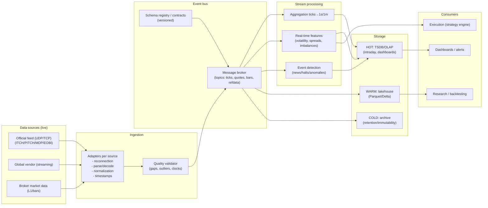

# Design and implementation of a global real-time stock market monitoring and execution system in R or Python

## Executive summary

A **global** real-time stock market monitoring and execution system is, in practice, **two coupled systems**: (1) a **data pipeline** with ingestion, normalization, storage, and low-latency analytics; and (2) an **execution pipeline** (OMS/EMS) with broker/venue connectivity, risk controls, audit, and observability. The bottleneck is rarely "the model" and almost always **correct data engineering + operational discipline** (pacing, reconnections, clock synchronization, idempotency, schema version control, and traceability). citeturn9search3turn10search12turn10search3

For global scope, the most robust (and realistic) technical recommendation is a **hybrid** approach:

- **Data**: prioritize **official/exchange feeds** when the use case demands it (microstructure, L2/L3, minimum latency, book reconstruction), but complement or even replace with **normalized global vendors** when the goal is multi-market coverage, lower contractual complexity, and faster time to production. (Examples of global vendors: B-PIPE, Real-Time, ICE Consolidated Feed). citeturn4search0turn4search13turn4search15turn0search33turn1search4turn1search9turn1search6turn17search1
- **Architecture**: strict separation between **data plane** (streaming + hot/warm/cold storage) and **execution plane** (signals → risk → orders → broker → fills), with queues/events as the "contract" between domains. citeturn9search3turn10search3turn10search12
- **Execution**: use brokers with **global coverage** and professional channels (REST + native APIs + FIX) when the use case warrants it; treat FIX as a serious integration project (certification, testing, and operations). citeturn6search0turn6search4turn13search3
- **Operations and compliance**: design from day 1 for audit and retention (e.g., recordkeeping frameworks such as SEC 17a‑4, or equivalent requirements in other jurisdictions), and observability (metrics/alerts/traces). citeturn12search0turn10search5turn11search0

The recommended roadmap is phased (MVP → controlled pilot → production with SLA), with measurable milestones in: market coverage, end-to-end latency, data quality, reconnection/replay robustness, simulation/paper trading, risk controls, and audit.

## Scope, assumptions, and design criteria

### Explicit assumptions for omissions in the statement

Since no budget, markets, permitted brokers, or investment horizon are specified, I will make "reasonable" assumptions (and mark them as such):

- **Assets**: equities/ETFs and, optionally, listed derivatives (depending on broker and feed availability). citeturn6search3turn6search7  
- **Latency objective**: **"operational real-time"** (tens to hundreds of milliseconds from tick to signal/alert), not necessarily sub-millisecond HFT (which typically requires co-location, specialized hardware, and more demanding data contracts). citeturn2search5turn2search3turn2search4  
- **Users**: 1–20 internal users initially (affects licenses/entitlements). citeturn4search19turn0search37  
- **Geographic scope**: at least the US, Europe (UK/EU), and Japan as a typical "triad" to test time zone complexity, auctions, and trading windows. citeturn14search0turn17search1turn14search3  

### What "real-time" means in this context

In finance, "real-time" can refer to three layers with very different implications:

1. **Display real-time** (dashboards and alerts): L1/Top-of-book + 1s/1m bars usually suffice in many cases. citeturn11search1turn3search8  
2. **Analytics real-time** (features, events, and scoring): requires streaming with clear retry/duplication semantics. citeturn10search12turn10search3  
3. **Execution real-time** (signal→order): demands risk controls, order state management, and tolerance for network/broker failures. citeturn13search1turn6search2turn6search0  

### Measurable success criteria

A rigorous design is governed by operational KPIs (not just PnL):

- **Data freshness** p50/p95/p99 per market (ms) and % of gaps/replays.
- **Execution**: rejection rate, slippage vs benchmark, fill ratio.
- **Risk**: exposures and drawdowns vs limits, "kill-switch time".
- **Reliability**: RPO/RTO, failover success, incident rate.
- **Audit**: completeness of logs/trails (signal→order→fill). citeturn12search0turn11search0turn10search2  

## Global market data: sources, granularity, schedules, latency, costs, and licenses

### Sources: official feeds vs global vendors

**Official/exchange feeds** (priority #1 by your criterion) are the "purest" route but entail:
- multiple protocols (ITCH/PITCH/EOBI/MDP, multicast UDP, recovery),
- per-exchange contracts,
- usage/entitlements reporting,
- and (often) connectivity in specific data centers. citeturn0search33turn1search0turn1search6turn1search9turn2search5turn2search3turn17search1  

Examples of primary feed documentation (widely used in the industry):
- entity["company","Nasdaq","us exchange operator"]: ITCH/TotalView (depth direct feed) specifications through published documentation. citeturn0search36  
- entity["company","New York Stock Exchange","us stock exchange"]: description of "Integrated Feed" as an order-by-order view of the market. citeturn0search33turn2search4  
- entity["company","Cboe Global Markets","global exchange operator"]: Multicast PITCH (Depth of Book) specification and licensing/redistribution clauses. citeturn1search0turn1search24  
- entity["company","CME Group","us derivatives exchange group"]: MDP 3.0 as a low-latency platform and interfaces/formats (SBE/FIX). citeturn1search9turn1search25  
- entity["company","Eurex","derivatives exchange"] (T7 platform): EOBI manual with operational notes (e.g., no backward compatibility between releases). citeturn1search6  
- entity["company","London Stock Exchange","uk stock exchange"]: technical documents with session schedules and structure (auctions, continuous trading). citeturn17search1turn15view0  
- entity["company","Japan Exchange Group","japan exchange group"]: data services (including "tick"-type historical data provided as PCAP) and scheduling rules. citeturn1search11turn14search3  

**Global vendors** (priority #2) reduce friction (one API, normalization, and support) and sometimes allow cloud deployment:
- entity["company","Bloomberg","financial data vendor"] – B‑PIPE (Market Data Feed) for normalized real-time data and cloud delivery. citeturn4search0turn4search24turn4search16  
- entity["company","Refinitiv","financial data vendor"] (LSEG ecosystem) – Real‑Time / RTSDK (pub/sub; on-prem or cloud deployment) and RDP APIs. citeturn4search13turn4search21turn4search5turn4search25  
- entity["company","ICE Data Services","market data vendor"] – ICE Consolidated Feed (aggregates hundreds of normalized sources). citeturn4search15turn4search7  
- entity["company","FactSet","financial data vendor"] – real-time data suite; even offers a feed via Kafka (relevant for ingestion). citeturn4search2turn4search30turn4search26  
- entity["company","SIX Group","swiss exchange group"] – market services/feeds and "exchange feeds" from SIX. citeturn4search35  

### Granularity: tick vs bars (1s/1m) and what you "lose" by aggregating

**Tick / event-by-event** (trades + quotes; ideally L2/L3) is essential if you need:
- book reconstruction (order book reconstruction),
- microstructure (impact, order flow, queue position),
- execution sensitive to spread/imbalances,
- faithful market replay. citeturn0search33turn1search0turn1search6turn1search9turn1search11  

A highly "primary" example: JPX indicates that its historical FLEX data can be delivered as **PCAP with reception timestamps**, useful for detailed analysis and backtesting. citeturn1search11turn1search19  

**1-minute (or 1-second) bars** are convenient for:
- monitoring and "semi-discretionary" or low/medium-frequency systematic investing,
- ML with OHLCV features,
- dramatic reduction of storage and complexity.

The downside: when aggregated, **intrabar sequence** information is lost, as are bid/ask dynamics and queues, which introduces backtest biases (e.g., "bar-based fill assumptions").

### Market schedules and the "market hours engine"

A global system needs a "schedule engine" that incorporates:
- time zones and seasonal changes,
- per-market holidays,
- auctions (open/close) and pauses (such as the break in Japan),
- and extended sessions if your broker allows them.

Primary examples (for calibrating the design):

- NYSE details sessions (pre-opening/early/core/late) and auctions (open/close) for various venues. citeturn14search0turn14search4  
- Nasdaq publishes trading hours (open/close) and (recently) documents on expansion/extended operations. citeturn14search1turn14search8turn14search12  
- JPX shows "Morning/Afternoon" sessions (with a break) for cash equities. citeturn14search3  
- LSE (Millennium) has technical documentation with session sequences (pre-trading, opening auction, continuous trading, closing auction). citeturn17search1turn15view0  

Forward-looking note: in the US there are movements toward nearly 24x5 trading (e.g., publicly reported proposals). This suggests that your schedule engine should be **configurable** and not "hardcoded". citeturn14news37turn14news27turn14search8  

### Latency, infrastructure, and co-location

Latency is not a single number; it is a chain: feed → decoding → bus → features → signal → risk → broker → venue. For very low latencies, presence in financial data centers and specialized connectivity is typically required.

- entity["company","Equinix","data center operator"] operates flagship data centers (e.g., NY11/LD4) used by financial ecosystems. citeturn2search1turn2search2turn2search18  
- Nasdaq describes its co-location offering for market proximity. citeturn2search5turn2search13  
- Deutsche Börse indicates the co-location data center (FR2) where primary back-ends of Eurex and Xetra reside. citeturn2search3  
- ICE/NYSE publishes technical specifications for connectivity/co-location and low-latency networks. citeturn2search0turn2search4  

image_group{"layout":"carousel","aspect_ratio":"16:9","query":["Equinix NY11 data center Carteret","Equinix LD4 Slough data center","Equinix FR2 Frankfurt data center","NYSE Mahwah data center colocation"],"num_per_query":1}

### Costs and licenses: what blows budgets (and they don't always warn you)

Market data costs tend to explode due to:
- depth (L1 vs L2/L3),
- number of markets,
- number of users/professionals,
- redistribution (internal vs external),
- and reporting/entitlements obligations.

Primary evidence of restrictions and reporting:
- Cboe explicitly states that certain datasets are proprietary and prohibits external redistribution. citeturn1search24  
- NYSE requires questionnaires/agreements for reception via data feed (a clear signal of contractual burden). citeturn0search37turn4search19  
- CTA/UTP (US SIP) provides consolidated access and pricing/fees via the plan itself. citeturn3search0turn3search1turn3search8turn3search13  
- Nasdaq publishes (in its rulebook) examples of connectivity fees for certain feeds in its data center. citeturn2search9  

### Comparative table of APIs and data providers

> Quick read: if your priority is "global + fast to integrate", consolidated vendors win. If your priority is "microstructure + latency + book", official feeds win, but with more engineering and licenses.

| Category | Example | Typical coverage | Granularity | Delivery | License complexity | When I would choose it |
|---|---|---|---|---|---|---|
| Official feed | Nasdaq TotalView/ITCH (direct feed) citeturn0search36 | One venue (or family) | L3/events (depending on product) | UDP/TCP per spec | High (contracts/infra) | Book reconstruction, microstructure research |
| Official feed | NYSE Integrated Feed (order-by-order) citeturn0search33turn2search4 | One venue (NYSE family) | Order-level | Market infra | High | Strategies sensitive to order flow on NYSE |
| Official feed | Cboe Multicast PITCH citeturn1search0turn1search24 | Cboe venues (per feed) | Depth of book | Multicast | High (and redistribution restrictions) | You need direct book from Cboe |
| Official feed | CME MDP 3.0 citeturn1search9turn1search25 | CME markets (derivatives) | Event-based; SBE/FIX | Multicast/TCP | High | Futures/options with low latency |
| Official feed | Eurex T7 EOBI citeturn1search6 | T7 venues | Full book (per manual) | Multicast | High | European derivatives (book) |
| Exchange feed (technical doc) | LSE Millennium (schedules/sessions) citeturn17search1turn15view0 | LSE/Turquoise depending on product | Market data ITCH/L2 (per service) | LSE infra | High | UK/EU equity with defined auctions and sessions |
| Global vendor | Bloomberg B‑PIPE citeturn4search0turn4search24turn4search16 | Multi-asset global | Normalized (per contract) | Managed feed / cloud | High but centralized | Institutional, multi-market, cloud delivery |
| Global vendor | Refinitiv Real‑Time/RTSDK citeturn4search13turn4search21turn4search25 | Global multi-market | Pub/sub, low latency | RTDS or cloud | High but centralized | "One feed" with pub/sub and dictionaries |
| Global vendor | ICE Consolidated Feed citeturn4search15turn4search7 | 600+ sources (per doc) | Normalized | Consolidated feed | High but centralized | Wide coverage, uniform integration |
| Global vendor / "feed-friendly" | FactSet Real‑Time + Kafka feed citeturn4search2turn4search30 | Multi-exchange | Real-time/delayed | APIs and Kafka | Medium-high | Native integration with streaming/events |

## Ingestion, storage, and real-time processing architecture

### Base pattern: adapters → event bus → stream processing → tiered storage

The recommended architecture separates functions by responsibility:

- **Market Data Adapters**: connectors per provider (WebSocket/UDP multicast/FIX market data), with:
  - reconnection,
  - deduplication and ordering,
  - sequence/recovery handling where applicable,
  - normalization to a stable *internal schema*.
- **Message broker**: the event "backbone" (topics per market/instrument).
- **Stream processing**: incremental feature calculation, event detection, aggregation (ticks→1s/1m), and signal publishing.
- **Storage**:
  - *Hot* (sub-second queries): time-series DB / columnar OLAP for intraday and dashboards.
  - *Warm* (research): compressed columns (Parquet/Delta) for backtesting and ML.
  - *Cold* (archive/regulatory): object storage + retention/immutability where applicable. citeturn10search3turn10search12turn12search0  

### Architecture diagram (data plane)



### Processing: "serious" streaming vs batching

For real-time analytics with consistency, two typical families:

- **Spark Structured Streaming-type engines**: "stream as table" model and end-to-end exactly-once guarantees with checkpointing (depending on compatible sources/sinks). citeturn10search3turn10search0  
- **Flink-type engines**: stateful stream processing with checkpoints and exactly-once semantics when restoring state/position. citeturn10search12turn10search20  

In many teams, the practical pattern is:
- lightweight streaming for immediate features/alerts (sub-second),
- and intraday/end-of-day batches for training, calibration, and reporting.

### Storage: quick comparison of databases for time series and trading

| Option | Strengths | Limitations | Best use in this system | Suggested primary source |
|---|---|---|---|---|
| TimescaleDB (Postgres + time series) | Continuous aggregates and incremental refresh citeturn5search0turn5search19 | Scale and tuning require a DBA; not a "HFT-tick store" by default | Hot/warm for bars, features, execution metrics | citeturn5search0turn5search19 |
| InfluxDB | TSDB model and write/schema practices citeturn5search1turn5search5 | Cardinality and tag design is critical | Observability + metrics + some aggregated market series | citeturn5search1turn5search5 |
| ClickHouse | Very strong in time-series analytics and query optimization citeturn5search2turn5search17 | Not OLTP; table modeling matters a lot | Warm/hot analytics: intraday research, TCA, large-volume joins | citeturn5search2turn5search17 |
| kdb+ / KX | Designed for financial time series; common RDB/HDB pattern in capital markets citeturn5search3 | Proprietary license and learning curve (q) | Classic tick store when the focus is market microstructure | citeturn5search3 |

## Order execution and broker connectivity

### Design principle: execution plane independent of the data plane

Your execution pipeline **should not** depend on the feed being perfect to operate (although it does for sensitive strategies). Separation allows:

- degrading to safe modes (reduce risk only, cancel, or "read-only"),
- maintaining order audit even if a data provider goes down,
- and testing execution with replay or paper trading.

### Architecture diagram (execution plane)

```mermaid
flowchart LR
  subgraph Strategy["Strategies"]
    S1["Rules (rule-based)"]
    S2["ML (scoring)"]
  end

  subgraph Signal["Signals"]
    G1["Signal service\n(versioned, traceable)"]
  end

  subgraph Risk["Risk (pre-trade)"]
    R1["Limits: notional, positions,\nconcentration, drawdown"]
    R2["Kill switch\n+ throttling"]
  end

  subgraph OMS["OMS/EMS"]
    O1["Order router\n(idempotency)"]
    O2["Order state\n(new/ack/partial/fill/cancel/reject)"]
  end

  subgraph Brokers["Broker connectivity"]
    B1["REST adapter"]
    B2["Native API adapter"]
    B3["FIX adapter"]
  end

  subgraph Audit["Audit and post-trade"]
    A1["Trade blotter / fills"]
    A2["TCA + reconciliation"]
  end

  Strategy --> G1 --> Risk --> OMS --> Brokers --> Audit
  OMS --> Audit
```



### Brokers and protocols: REST vs native API vs FIX

- **REST**: fast to integrate, good for low/medium-frequency orders; typically has rate limits and higher latency. citeturn6search2turn18search2  
- **Native API (socket)**: better state control and sometimes lower latency; requires concurrency management, pacing, and reconnection. In IB's case, the API uses a connection to TWS/IB Gateway via socket and EClient/EWrapper classes. citeturn13search3turn13search9  
- **FIX**: the industry standard for institutional routing, but entails an integration/certification process; in IB it is managed with their FIX Engineering team and is oriented toward order routing. citeturn6search0turn6search4  

### Comparative table of brokers (execution)

| Broker | Coverage | APIs | Technical fine points | Recommended for |
|---|---|---|---|---|
| entity["company","Interactive Brokers","global online broker"] | Global multi-asset access; IBKR reports 170+ markets / 40 countries (per their public pages) citeturn6search3turn6search7 | TWS API (socket), Web API (OAuth2), FIX (order routing) citeturn13search3turn6search12turn6search0 | Typical message limit: 50 msgs/sec in TWS API (error codes); Web API with rate limits (e.g., 10 rps per session, per doc/page) citeturn18search1turn18search5 | Global coverage with a single broker; "serious" execution with state control |
| entity["company","Saxo Bank","danish investment bank"] | Multi-market (per commercial offering) | OpenAPI: endpoints for price subscriptions and placing orders; supports /precheck to simulate costs/outcome without executing citeturn6search17turn6search29 | Good "precheck→order" pattern; useful for estimating costs/risk before sending citeturn6search29 | Platforms/partners, product-oriented integrations |
| entity["company","Alpaca","us broker api trading"] | Primarily US (per their API trading positioning) | Trading API (monitor/place/cancel), order examples and docs citeturn6search2turn6search10 | Ideal for prototypes and paper/live with the same API in many cases (per docs and common practice) citeturn6search10 | Fast MVP and testing; US-centric strategies |

## Strategy automation, risk management, and backtesting/simulation

### Strategies: concrete examples (rule-based and ML)

**Rule-based example (robust and auditable)**  
"Breakout + volatility filter" strategy on 1m bars:
- If the price breaks the 20-bar high and intraday volatility is below threshold → enter.
- Exit by stop (ATR) or time-based (end of session).
This family is easy to:
- backtest,
- monitor,
- and explain (compliance-friendly).

**ML example (useful, but with more overfitting risk)**  
5–15 minute return classification:
- features: returns, volatility, spread proxy, imbalance (if book is available), auction events.
- model: gradient boosting or logistic regression (baseline).
In production, ML must go through:
- drift control,
- performance monitoring by regime,
- and exposure limits (ML without guardrails is a teenager with a Ferrari).

### Backtesting and simulation: paper trading + replay

Minimum best practices:
- **Paper trading** before going live (IB recommends validating orders in paper before live). citeturn13search1  
- **Market replay**: reinject historical events through the same bus/processing for end-to-end testing; for certain markets there are tick/pcap-level historical data (e.g., JPX FLEX Historical). citeturn1search11turn1search19  
- **Separate fill model**: "bar-based" backtesting requires fill assumptions; if you trade fine intraday, migrate to tick/L2 and add costs/latency/slippage.

### Recommended libraries in R and Python (streaming, ML, backtesting, execution)

> Practical rule: use Python for "industrial" ingestion/execution/ML; use R for research/statistics/validation (although everything can be done in both).

| Domain | Python | R | Notes / Source |
|---|---|---|---|
| WebSocket/streaming | `websockets` (asyncio) citeturn9search0turn9search12 | `websocket` (CRAN) citeturn7search0turn7search4 | WebSocket is common in modern vendors |
| Kafka client | `confluent-kafka-python` citeturn9search2turn9search10 | (R has no active "CRAN standard"; wrappers exist, but evaluate maturity) citeturn7search1turn7search29 | In R, typically preferred to integrate via microservice or internal REST |
| Backtesting | vectorbt citeturn8search0turn8search37 / backtrader citeturn8search1turn8search14 | quantstrat (signal infrastructure) citeturn7search6turn7search2 | quantstrat is not "plug and play" in CRAN; vectorbt is very fast in parallel |
| Execution | IB TWS API (official) citeturn13search3turn13search0 / FIX engine QuickFIX citeturn8search9turn8search3 | IBrokers (R↔TWS; check scope) citeturn7search3turn7search7 | FIX requires formal integration with broker (not just library) citeturn6search0 |
| ML | scikit‑learn, xgboost/lightgbm (de facto standard) | tidymodels/caret (per preference) | (Here the primary source is usually the official documentation of each library; omitted for brevity) |

### Code snippets (without real credentials)

> The examples are intentionally "minimal" and should be wrapped with error handling, retries with backoff, and state control in production.

#### Python: streaming ingestion (WebSocket → Kafka)

```python
import asyncio
import json
import time
import websockets
from confluent_kafka import Producer

KAFKA_BOOTSTRAP = "localhost:9092"
TOPIC = "market.ticks"

producer = Producer({"bootstrap.servers": KAFKA_BOOTSTRAP})

def delivery_report(err, msg):
    if err is not None:
        print(f"[Kafka] delivery failed: {err}")

async def ingest():
    # Fictional endpoint; each vendor defines its own format
    ws_url = "wss://stream.provider.example/v1/quotes?token=REPLACE_TOKEN"

    while True:
        try:
            async with websockets.connect(ws_url, ping_interval=20, ping_timeout=20) as ws:
                # Fictional subscription
                await ws.send(json.dumps({"type": "subscribe", "symbols": ["AAPL", "MSFT"], "schema": "ticks"}))

                async for raw in ws:
                    event = json.loads(raw)
                    event["_ingest_ts_ms"] = int(time.time() * 1000)

                    key = event.get("symbol", "NA").encode("utf-8")
                    val = json.dumps(event).encode("utf-8")

                    producer.produce(TOPIC, key=key, value=val, on_delivery=delivery_report)
                    producer.poll(0)  # triggers callbacks without blocking

        except Exception as e:
            print(f"[Ingest] error: {e}. Retrying in 5s...")
            await asyncio.sleep(5)

if __name__ == "__main__":
    asyncio.run(ingest())
```

#### R: streaming ingestion (WebSocket → in-memory buffer / simple persistence)

```r
library(websocket)
library(jsonlite)

# Fictional endpoint; each vendor defines its own format
ws_url <- "wss://stream.provider.example/v1/quotes?token=REPLACE_TOKEN"

# Simple buffer (in production: queue/DB)
buffer <- list()

ws <- WebSocket$new(ws_url, autoConnect = FALSE)

ws$onOpen(function(event) {
  # Fictional subscription message
  ws$send(toJSON(list(
    type = "subscribe",
    symbols = c("AAPL", "MSFT"),
    schema = "minute_bars"
  ), auto_unbox = TRUE))
})

ws$onMessage(function(event) {
  msg <- fromJSON(event$data)
  msg$ingest_ts_ms <- as.integer(as.numeric(Sys.time()) * 1000)
  buffer[[length(buffer) + 1]] <<- msg

  if (length(buffer) %% 100 == 0) {
    cat("Buffer size:", length(buffer), "\n")
  }
})

ws$onError(function(event) {
  cat("WebSocket error:", event$message, "\n")
})

ws$onClose(function(event) {
  cat("WebSocket closed. Code:", event$code, "Reason:", event$reason, "\n")
})

ws$connect()
```

#### Python: simple strategy (SMA crossover) + order (IB TWS API "skeleton")

The official IB documentation shows that orders are submitted with `EClient.placeOrder`. citeturn13search0turn13search9

```python
# Minimal strategy on already-aggregated bars (pandas) + placeOrder skeleton.
# Note: IB TWS API requires an app based on EClient/EWrapper and nextValidId handling.

import pandas as pd

def sma_crossover_signal(df: pd.DataFrame, fast=10, slow=30):
    df = df.copy()
    df["sma_fast"] = df["close"].rolling(fast).mean()
    df["sma_slow"] = df["close"].rolling(slow).mean()
    df["signal"] = (df["sma_fast"] > df["sma_slow"]).astype(int)
    df["trade"] = df["signal"].diff().fillna(0)
    return df

# Execution pseudocode (not runnable without the full IB API structure):
# if last_row["trade"] == 1:
#     place BUY
# elif last_row["trade"] == -1:
#     place SELL
#
# -> in IB, done with client.placeOrder(orderId, contract, order)
```

#### R: simple strategy (SMA) + order via REST (Alpaca-style example)

The order documentation via API indicates that you can "monitor, place, cancel orders". citeturn6search2

```r
library(httr2)
library(TTR)

# --- Simple signal ---
close <- c(100,101,102,101,100,99,100,102,104,103,105,106,104,103,102,101)
sma_fast <- SMA(close, n = 3)
sma_slow <- SMA(close, n = 7)

signal <- ifelse(sma_fast > sma_slow, 1, 0)
trade  <- c(NA, diff(signal))

# --- Order via REST (illustrative endpoint; DO NOT paste real credentials) ---
base_url <- "https://paper-api.alpaca.markets"   # common paper example
api_key  <- "REPLACE_KEY"
api_sec  <- "REPLACE_SECRET"

place_order <- function(symbol, qty, side = c("buy","sell"), type = "market", tif = "day") {
  side <- match.arg(side)

  req <- request(paste0(base_url, "/v2/orders")) |>
    req_headers(
      "APCA-API-KEY-ID" = api_key,
      "APCA-API-SECRET-KEY" = api_sec
    ) |>
    req_body_json(list(
      symbol = symbol,
      qty    = qty,
      side   = side,
      type   = type,
      time_in_force = tif
    ))

  # In production: validate response, retries, idempotency keys, logging
  resp <- req_perform(req)
  resp_body_json(resp)
}

# if (!is.na(tail(trade, 1)) && tail(trade, 1) == 1) {
#   place_order("AAPL", 1, "buy")
# }
```

## Operations: deployment, observability, security, compliance, costs, and roadmap

### Deployment options: cloud, on-prem, and containers

The cloud vs on-prem decision is not ideological: it is a function of required latency, compliance, and costs.

- **Containers**: a container is an isolated process with everything needed to run; it is ideal for packaging ingestion/strategy microservices. citeturn11search3  
- **Kubernetes**:
  - `Deployment` for stateless services (adapters, APIs, strategy runners). citeturn11search6  
  - `StatefulSet` for stateful components (TSDB, brokers) when operated inside the cluster. citeturn11search2  

Cloud (examples):
- entity["company","Amazon Web Services","cloud provider"] offers managed services for streaming (e.g., managed Flink) and claims of exactly-once in its service. citeturn10search38  
- entity["company","Microsoft Azure","cloud provider"] and entity["company","Google Cloud","cloud provider"] are natural alternatives if your organization is already standardized there (the decision is usually "where does the rest of your company live"). citeturn4search32turn10search38  

### Observability: metrics, logs, traces, and alerts

A real-time system without observability is like driving at night without headlights… fast, but brief.

- Prometheus defines alerting rules based on expressions and sends alerts to Alertmanager. citeturn11search0  
- Alertmanager deduplicates, groups, and routes notifications. citeturn11search4  
- For visualization, "time series panels" are the standard for timestamped data. (This is where the Grafana-type stack comes in.) citeturn11search1  
- OpenTelemetry defines the framework for collecting/exporting observability signals (traces/metrics/logs) and correlating them. citeturn10search5turn10search2  
- entity["company","Grafana Labs","observability company"] documents time series visualizations as default for variation over time. citeturn11search1  

**Dashboard suggestion (minimum 1, highly useful)**  
A dashboard with panels for:
- **End-to-end latency** (ingest_ts vs event_ts) p50/p95/p99 per market.
- **Throughput**: msgs/s per topic (ticks/quotes/bars).
- **Errors**: reconnections, detected gaps, order rejects.
- **Risk**: proxy VaR/intraday drawdown, net/gross exposure.
Grafana supports time series panels for this type of visualization. citeturn11search1  

### Security: authentication, secrets, and risk posture

- Modern APIs typically use OAuth 2.0; the base specification (RFC 6749) defines the delegated authorization framework. citeturn12search6  
- For a formal security program, entity["organization","ISO","standards body"] describes ISO/IEC 27001 as a recognized standard for ISMS (information security management). citeturn12search2  

Practical controls (engineering):
- secrets in vault/KMS, rotation, minimum privilege,
- TLS/mTLS internal,
- network segregation (ingest vs execution),
- event signing/fingerprinting (integrity),
- and *break-glass* to stop trading.

### Compliance and audit: recordkeeping and traceability

- entity["organization","SEC","us securities regulator"] explains that amendments to Rule 17a‑4 retain WORM as an option and incorporate an audit-trail-based alternative for electronic recordkeeping. citeturn12search0  
- entity["organization","FINRA","us broker-dealer regulator"] summarizes retention (e.g., preservation periods and accessibility) and interpretive references associated with 17a‑4. citeturn12search3  

Recommended audit design:
- event sourcing of: *market event → feature → signal → decision → order → ack/reject → fill*,
- correlatable IDs (trace IDs),
- configuration snapshots per release (strategy/risk versioning).

### Cost estimates (low/medium/high)

> These are indicative ranges (assumption), because final prices depend on markets, depth, professional users, redistribution, and connectivity. For "public" cost anchors, one can look at SIP (CTA/UTP) pricing/fees and connectivity fee examples in rulebooks. citeturn3search0turn2search9

| Scenario | Objective | Data | Infra | Monthly order of magnitude (USD, assumption) |
|---|---|---|---|---|
| Low | Monitoring + simple execution in 1 region | Broker/vendor APIs, 1m/L1 bars, no L2 | 1–3 VMs/containers, simple TSDB | 500 – 5,000 |
| Medium | Multi-market (3 regions), serious intraday | global vendor + some key feeds; 1s/1m + some tick | Kafka + TSDB/OLAP + lake, dev/stg/prod environments | 10,000 – 80,000 |
| High | Low latency + book + co-location | multiple direct feeds L2/L3 + data center infrastructure | co-location + cross-connects + hardware + enterprise licenses | 150,000 – 1,000,000+ |

### Phased roadmap with milestones and timeline

> Suggested timeline assuming small team (2–6 dev/quant/ops) and without severe contractual blockers.

**Foundation phase** (weeks 1–4)  
Milestones:
- Define universes (markets/instruments), target frequency (tick/1s/1m), and latency SLA.
- Design canonical schema (tick/quote/bar/order/fill) + versioning.
- Minimum infra: CI/CD repos, containers, structured logging, base metrics.

**Functional MVP phase** (weeks 5–10)  
Milestones:
- 1 data provider (ideally vendor or broker) + 1 broker in paper.
- End-to-end pipeline: ingestion → bus → features → signal → risk → order → fill.
- Health dashboard (latency, gaps, rejects, simulated PnL).
- Simple simulator (bar replay) and reconnection tests.

**Pilot with risk controls phase** (weeks 11–18)  
Milestones:
- Incorporate 2–3 markets with schedule engine.
- Complete risk manager (limits, kill-switch, throttling, reconciliation).
- Systematic backtesting + basic TCA.
- Stress tests (throughput) and failure tests (broker down, degraded feed).

**Production phase** (months 5–9)  
Milestones:
- Definitive contracts/licenses (if moving to official feeds).
- Security hardening (OAuth/secrets, segmentation, audit).
- HA/DR (RTO/RPO), runbooks, and incident response.
- Onboarding of additional strategies (rule-based + ML with drift monitoring).

**Global scaling phase** (months 9–18)  
Milestones:
- More venues and, if applicable, co-location in critical markets.
- Multi-broker routing (internal best execution) and FIX for institutional flows.
- Mature data lake for large-scale research and continuous training.
