# Big short contra una posible burbuja de IA: diseño riguroso de la tesis, instrumentos, riesgos y despliegue operativo

## Resumen ejecutivo

Apostar “en grande” a una caída del “boom de IA” no es una sola operación: es un **portafolio de instrumentos** (acciones en corto, opciones, spreads, ETFs inversos, futuros y, para instituciones, eventualmente swaps/CDS) gobernado por un **motor de riesgo** que debe sobrevivir: (i) a escenarios donde **el mercado sigue subiendo mucho más de lo racional** (la parte favorita de las burbujas), (ii) a **short squeezes** y (iii) a **costos variables** (borrow fees, margin, slippage, IV y “gap risk”). La ejecución “rápida” sin ese motor suele terminar en el clásico “tenía razón, pero me quedé sin margen”. citeturn6search3turn4search0turn4search1

Como contexto, varias instituciones han señalado que el rally asociado a IA vino acompañado por **preocupaciones sobre valuaciones estiradas** y **concentración** en mega-caps tecnológicas, con sensibilidad a shocks (geopolítica, tasas, guidance y expectativas sobre productividad real de IA). citeturn6search1turn6search0turn2search12turn6search2 Además, la literatura académica reciente discute mecanismos por los cuales la IA puede sostener **equilibrios especulativos frágiles** (valuaciones elevadas que dependen de creencias coordinadas y pueden romperse abruptamente). citeturn2search2

La forma más prudente de “shortear una narrativa” es preferir estructuras con **pérdida máxima acotada** (puts, spreads, collars, pares long/short) y usar el corto en acciones **solo** donde (a) el préstamo sea razonable y (b) el riesgo de squeeze sea gestionable. Para retail, además, hay instrumentos “tentadores” pero peligrosos para holdings largos, como ETFs inversos apalancados con rebalanceo diario. citeturn1search0turn1search1

Supuestos (porque no se especifican): capital y tolerancia al riesgo **moderados**, jurisdicción inicial **Chile** (por tu zona horaria) pero operativa potencialmente internacional, y broker no definido (se comparan opciones). Estas hipótesis cambian bastante si estás en EE. UU./UE/UK, si operas como institución, o si tu mandato permite derivados/OTC. citeturn3search15turn3search0turn0search10

## Contexto y evidencia de sobrevaloración o fragilidad del “trade IA”

La afirmación “hay burbuja” es **una hipótesis**, no un hecho. Un enfoque riguroso es separar: (1) señales de **valuación/expectativas**; (2) señales de **microestructura/posicionamiento**; y (3) señales de **catalizadores**.

**Señales macro-financieras y de valoración (visión institucional)**  
- entity["organization","Bank for International Settlements","bank for intl settlements"] ha destacado que el boom de precios asociado a IA ha influido en mercados, y que hacia fines de 2025 se observó “wariness” por **valuaciones estiradas**. citeturn6search1 En su revisión de marzo de 2026, también se menciona sensibilidad de tech/IA a preocupaciones sobre gasto de IA y disrupción, en un entorno de mayor volatilidad. citeturn6search0  
- entity["organization","International Monetary Fund","global financial stability report"] ha señalado (GFSR 2025) que los **modelos de valuación** sugieren precios de activos de riesgo **por encima de fundamentos**, elevando la probabilidad de correcciones desordenadas ante shocks. citeturn6search2  
- entity["organization","European Central Bank","economic bulletin focus box"] ha enfatizado vulnerabilidad por **valuaciones elevadas** y **concentración**, y subraya incertidumbre sobre productividad “realizada” de IA (riesgo de “risk-off” si cambian expectativas). citeturn2search12  

**Señales de concentración (fragilidad estructural)**  
Aunque “IA” no es un sector GICS único, el trade suele estar altamente concentrado en mega-caps tecnológicas y semis. Esto importa porque en shocks el drawdown puede amplificarse si la indexación y la ponderación por capitalización actúan como “feedback”. (La concentración por sí sola no prueba burbuja, pero sí **fragilidad**.) citeturn2search12

**Evidencia académica sobre “dinámicas tipo burbuja”**  
- entity["organization","National Bureau of Economic Research","working paper series"] publicó en 2026 un trabajo explícitamente sobre AI “bubble” en el sentido de **equilibrios especulativos racionales pero frágiles**. Es útil no por predecir el “pinchazo”, sino por formalizar *por qué* puede sostenerse y *cómo* puede romperse. citeturn2search2  
- Trabajos sobre revaluación de firmas expuestas a GenAI post-ChatGPT examinan cómo el mercado re-pricea exposición; esto te ayuda a construir “factor de exposición IA” para selección de objetivos (ver más abajo). citeturn2search6  

**Ejemplos de “objetos IA” en bolsa (ilustrativo, no recomendación)**  
- “Enablers” (semiconductores, infraestructura, data centers, networking).  
- “Platforms” (hiperscalers y software de IA).  
- “Narrativa/alta beta” (empresas que se reetiquetan como IA con fundamentals débiles).  

Lo riguroso aquí es no enamorarse del headline “IA”: el short suele funcionar mejor cuando apuntas a **descalces medibles** (margen vs valuación, cash burn vs múltiplos, dependencia de financiamiento) y no a “la IA en general”.

## Instrumentos para apostar a la baja y comparativa práctica

Primero, una advertencia (sin dramatismo, pero real): vender en corto puede generar **pérdidas ilimitadas** si el precio sube; además exige cuenta margen y préstamo/entrega. citeturn6search3turn0search1 Por eso, muchas tesis “big short” se implementan con **opciones** o **estructuras con pérdida acotada**.

### Tabla comparativa de instrumentos bajistas (retail e institucional)

| Instrumento | Ventaja principal | Pérdida máxima | Costos clave | Riesgos “feos” (los que quiebran cuentas) | Cuándo tiene sentido |
|---|---|---|---|---|---|
| Venta en corto de acciones (covered short) | Exposición lineal; puedes mantener mientras dure la tesis | Teóricamente ilimitada | Borrow fee variable (hard-to-borrow), margin, dividendos (pagas dividendos si estás short) | Short squeeze, recalls, margin calls, “locate” y close-out requeridos por regulación | Solo en nombres líquidos, borrow razonable, y con gestión de riesgo estricta citeturn6search3turn4search0turn0search1 |
| Put (compra de put) | Convexidad; pérdida limitada al premio | Premio pagado | Prima + spread; decay (theta) | Timing: si tardas, la opción muere “por tiempo”; IV puede colapsar | Cuando esperas caída grande/rápida o quieres pérdida acotada citeturn1search6turn4search11 |
| Put spread (debit put spread) | Baja costo vs put; pérdida acotada | Prima neta | Prima neta; menos vega | Ganas menos si la caída es enorme | Cuando esperas caída moderada y quieres mejor “cost-benefit” citeturn4search3 |
| ETF inverso (1x) | Simplicidad; no requiere préstamo de acciones | Limitada al capital invertido | Tracking error y costos del ETF | Tracking vs índice; en horizontes largos se desvía | Para hedge táctico sin opciones (si existe el ETF) citeturn1search0 |
| ETF inverso apalancado (2x/3x) | Potencia de corto plazo | Limitada al capital invertido | Efectos de compounding + costos | Holding >1 día puede divergir mucho del objetivo diario | Solo trading muy corto y con entendimiento pleno del reset diario citeturn1search0turn1search1 |
| CFDs (donde sean legales) | Acceso fácil a short; apalancamiento | Puede exceder capital si no hay protección (según régimen) | Spread + financing + comisiones | Alto riesgo retail; intervención regulatoria europea por daño al consumidor | Si estás en jurisdicción donde aplica y con control estricto; generalmente no es “core” para una tesis grande citeturn1search3 |
| Futuros (índices/sectores) | Liquidez; hedge limpio de beta | Pérdida grande posible (margen) | Márgenes, roll, slippage | Gap risk, llamadas de margen | Para expresar “beta/sector” sin single-name squeeze (p.ej., Nasdaq) |
| Swaps / CDS (institucional) | Eficiencia de balance y personalización | Depende del contrato (puede ser muy grande) | Spreads OTC, CSA, colateral | Riesgo contraparte, legal/ISDA, reporting | Para instituciones con infraestructura legal y de colateral; no típico retail citeturn0search10turn5view0 |

### “Cómo elegir el instrumento” en una frase

- Si tu mayor riesgo es “estar equivocado por tiempo”: **spreads** y **estructuras baratas** ganan.  
- Si tu mayor riesgo es “squeeze / borrow caro”: **puts** y **pares** ganan.  
- Si tu riesgo es “beta de mercado”: complementa con **futuros/ETFs** para aislar factor.

## Selección de objetivos, timing y gestión de riesgo

Aquí es donde se gana o se pierde. La tesis “IA está cara” es demasiado amplia; necesitas un **universo objetivo** y reglas de **entrada/salida** que sobrevivan a mercados irracionales más tiempo que tu margen.

### Selección de activos objetivo (criterios cuantificables)

Un marco útil es puntuar cada candidato con un **score de vulnerabilidad** (0–100), compuesto por bloques:

1) **Valuación vs fundamentals** (ejemplos de métricas)  
EV/Sales, P/FCF, crecimiento implícito vs guidance, margen bruto y operating leverage, concentración de clientes, dependencia de capex, dilución. (La medición exacta depende de tu dataset; la idea es identificar “price implies perfection”.) citeturn6search2turn6search0

2) **Sensibilidad a narrativa IA**  
Construye “IA exposure” (texto en 10‑K/MD&A, releases de producto, % revenue AI-linked, capex AI). Académicamente, se ha estudiado la revaluación de firmas expuestas a GenAI como fenómeno cross-sectional. citeturn2search6

3) **Fragilidad técnica/posicionamiento**  
- Volatilidad implícita vs histórica (IV/RV), skew de puts, gamma de dealers (si tienes data).  
- Short interest / days-to-cover (con cuidado: alto short interest puede ser “oportunidad” o “trampa mortal”). Reportes de short interest existen con calendario y reglas (en EE. UU. vía FINRA para firms). citeturn4search2turn4search6

4) **Riesgo operativo del corto**  
Borrow fee, disponibilidad, “hard-to-borrow”, probabilidad de recall. En IB, el borrow fee se determina por oferta/demanda y puede ser alto; incluso puede haber “rebate negativo” si el borrow excede el interés ganado por proceeds. citeturn4search0turn4search4turn4search8

**Atajo práctico (“rápido pero no irresponsable”)**  
En vez de shortear 1–2 nombres, crea una **canasta** (basket) de 10–30 “AI-high-beta” y exprésala con puts sobre ETF/índice + un pequeño overlay de single-name donde el borrow sea benigno. Reduce el riesgo de “un squeeze te mata la tesis correcta”.

### Timing: señales de entrada y salida (fundamentales, técnicas y catalizadores)

**Señales de entrada (ejemplos)**  
- **Fundamentales**: desaceleración de ingresos “AI-linked”, presión en márgenes por competencia, capex subiendo más rápido que retorno, guidance prudente. BIS menciona sensibilidad del mercado a preocupaciones de gasto/retorno en IA y valuaciones ricas. citeturn6search0turn6search1  
- **Régimen macro**: subida de tasas reales, widening de spreads crediticios, shock de riesgo (la tesis “valuación estirada” suele materializarse cuando cambia el descuento). citeturn6search2turn2search12  
- **Técnico**: quiebre de tendencia (p.ej., debajo de MA200) + aumento de volatilidad + distribución (volumen en caídas).  

**Señales de salida (ejemplos)**  
- Caída grande + IV colapsa (tomas ganancias en puts).  
- Mean reversion o intervención/reglas (prohibiciones temporales de cortos han existido históricamente en crisis). citeturn5view2turn3search0  
- Tu propio risk engine te saca: drawdown límite, borrow se vuelve prohibitivo, o correlaciones cambian.

### Tamaño de posición y risk management (con ejemplos de coberturas)

**Reglas robustas (para no morir en el intento)**  
- Define pérdida máxima por idea: p.ej., 0.5%–2% del NAV por “trade”.  
- Prefiere instrumentos con pérdida acotada para la “pata big short” (puts/spreads).  
- Si usas cortos en acciones, impón: (i) límite de borrow fee anualizado permitido, (ii) límite de days-to-cover, (iii) stop por squeeze (precio + borrow + noticias).

**Ejemplos de hedges (estructuras)**  
- **Protective put**: si estás largo en un índice/sector y quieres cubrir un crash IA. (Estrategia estándar: comprar put para acotar pérdida). citeturn4search14turn4search3  
- **Call overwriting (covered calls)**: si tienes exposición larga a tech pero quieres monetizar prima; no es short puro, pero reduce costo de carry.  
- **Pair trade**: short “AI hype” vs long “AI beneficiario con fundamentals sólidos” (neutralizas beta). Útil cuando dudas del timing macro.

## Implementación operativa en tu sistema: datos, ejecución, monitoreo y testing

Esta sección traduce la tesis al “sistema real”: señal → riesgo → orden → borrow → monitoreo → hedge → cierre.

### Flujo operativo requerido (Mermaid)

```mermaid
flowchart LR
  A["Datos\n(precios, IV, fundamentals,\nshort interest, borrow fee)"] --> B["Señal\n(score + triggers"]
  B --> C["Risk engine\nlímites, VaR, DD,\nexposure, kill switch"]
  C --> D["Decisión de instrumento\n(puts/spreads/short/ETF/futuro)"]
  D --> E["Pre-trade checks\nmargen, liquidez,\nslippage, borrow"]
  E --> F["Order router\n(order types, pacing)"]
  F --> G["Borrow / Locate\n(si es short stock)"]
  G --> H["Ejecución y fills\nreconciliación"]
  H --> I["Monitoreo\nPnL, margin ratio,\nborrow fee, utilization,\nshort interest, days-to-cover"]
  I --> J["Hedge manager\nprotective puts,\npairs, reduce exposure"]
  J --> K["Cierre\ntake profit / stop /\nroll de opciones"]
  I --> C
```



### Datos necesarios (mínimos) y fuentes típicas

1) **Precios y barras**: para señales y ejecución (1m suele bastar si “latency not critical”).  
2) **Opciones**: cadena (strikes/exp), IV, greeks, spreads. Para riesgo, la referencia primaria de riesgos de opciones está en el ODD de OCC (lectura obligada antes de operar). citeturn1search6  
3) **Borrow y disponibilidad**: si vas a short stock, necesitas borrow fee y shortable shares. En IB existen páginas y herramientas para estimar costo y disponibilidad. citeturn4search0turn4search4turn4search19  
4) **Short interest**: útil como métrica de squeeze y crowdedness. En EE. UU. hay régimen de short interest reporting para firms (FINRA). citeturn4search2turn4search6  
5) **Calendarios/reglas locales**: si operas Chile/España/UE, integrar constraints de régimen local (prohibiciones temporales, reporting). citeturn3search0turn3search2turn5view0  

### Tabla comparativa de brokers/plataformas para implementar la estrategia

> Nota: disponibilidad de instrumentos varía por país/cuenta. No es recomendación; es un mapa de “capacidad técnica típica”.

| Broker/plataforma | Cobertura típica | Instrumentos relevantes | Datos de borrow/short | APIs | Comentario operativo |
|---|---|---|---|---|---|
| entity["company","Interactive Brokers","global broker api"] | Global multi-mercado | Acciones, opciones, futuros (según mercado) | Publica costo y disponibilidad (herramientas/guías) citeturn4search0turn4search4 | API nativa + FIX (según oferta) | Muy útil para “una sola cuenta” con alcance global y control de margen citeturn4search1turn4search5 |
| entity["company","Saxo Bank","saxo openapi broker"] | Multi-mercado (según región) | Acciones, opciones, CFDs (según jurisdicción) | Varía | OpenAPI | Bueno para integraciones tipo “precheck” y workflows API citeturn5view0 |
| entity["company","IG","cfd provider uk"] | Dependiente de jurisdicción | CFDs (donde legal) | N/A (es derivado OTC del broker) | APIs (según oferta) | CFDs están bajo marcos de intervención y warnings en UE citeturn1search3 |

### Órdenes, tipos y ejecución

Si “latency not critical”, el objetivo es **calidad de fills + controles**:
- Market vs limit: para single-names volátiles, preferir limit con protección.  
- Órdenes por tramos (iceberg/algos) si tamaño vs ADV lo requiere (depende de broker/venue).  
- Throttling/pacing y reintentos idempotentes para evitar duplicados.

### Métricas de monitoreo en producción (las que importan)

- **Borrow**: borrow fee anualizada, disponibilidad/shortable shares, recalls (si el broker lo informa). citeturn4search0turn4search4  
- **Crowdedness**: short interest (nivel y cambios), days-to-cover (derivado), “utilization” si tienes proveedor de securities lending. citeturn4search2  
- **Riesgo de cuenta**: margin ratio, exceso de margen, probabilidad de liquidación forzada (cada broker define/wizard). citeturn4search1turn4search5  
- **PnL y riesgo**: PnL realizado/no realizado, VaR/ES (si calibras), drawdown intradía, exposición neta/bruta y por factor.  
- **Opciones**: delta/gamma/vega agregados, theta diario, exposición a gap.

**Sugerencia de gráfico (para tu monitoring y para post-mortems)**  
- “PnL acumulado vs costo de borrow” (línea PnL y área de carry). Esto te muestra si estás “pagando por tener razón” demasiado tiempo. citeturn4search0  
- “Short interest vs precio” (si tienes short interest histórico) para detectar squeezes potenciales. citeturn4search2  

### Backtesting y simulación (lo mínimo para no autoboicotearte)

- Replay bar (1m) para señal + ejecución simplificada (slippage model).  
- Stress tests: +20% gap up overnight y expansión de IV; y “borrow fee shock” (pasa de 2% a 30% anual). Esto es esencial porque el borrow fee es endógeno a oferta/demanda. citeturn4search8turn4search0  
- Para ETFs inversos apalancados, testea holding multi-día con compounding; reguladores advierten que el desempeño en horizontes >1 día puede diferir significativamente del objetivo diario. citeturn1search0turn1search1  

## Legal/compliance, costos y roadmap rápido de despliegue

### Consideraciones legales y de compliance (alto nivel, multi-jurisdicción)

**Estados Unidos**  
- La venta en corto está sujeta a **Regulation SHO**, incluyendo requerimientos de locate/borrow antes de ejecutar (Rule 203) y reglas de close-out para fallas de entrega. citeturn0search1turn0search9  
- SEC publica material educativo sobre qué es short selling y riesgos (pérdidas potencialmente ilimitadas). citeturn6search3  
- Short interest: FINRA requiere reporting de posiciones short (rulebook 4560) con calendario y definiciones. citeturn4search2turn4search6  

**Unión Europea**  
- Existe un reglamento armonizado sobre ventas en corto y ciertos aspectos de CDS (SSR). citeturn0search10  
- entity["organization","European Securities and Markets Authority","eu markets regulator"] mantiene documentación y enlaces a divulgaciones nacionales; también ha propuesto/revisado umbrales de reporte en distintos momentos. citeturn5view1  
- En CFDs, se implementaron medidas de intervención para protección del inversor en la UE (apalancamiento, protección saldo negativo, warnings). citeturn1search3  

**Reino Unido**  
- entity["organization","Financial Conduct Authority","uk financial regulator"] describe el régimen de notificación/divulgación; por ejemplo, indica que el régimen público individual aplica desde 0.5% (y discute reformas 2025 en consulta/implementación). citeturn5view0  

**Chile (por contexto regional y fuentes en español)**  
- entity["organization","Comisión para el Mercado Financiero","chile regulator"] publica normativa/resoluciones relacionadas con manuales de venta corta y préstamo de acciones en bolsas locales. citeturn3search2  
- entity["organization","Comisión Nacional del Mercado de Valores","spain regulator"] ofrece material sobre ventas en corto y obligaciones asociadas bajo SSR (útil como referencia en español, aunque España ≠ Chile). citeturn3search0turn3search12  

> Advertencia legal: esto no es asesoría legal. Antes de operar, valida requisitos exactos en tu jurisdicción, tipo de cuenta (retail/pro), y si hay restricciones temporales a cortos en eventos de stress. citeturn0search10turn3search0turn5view0  

### Costos estimados y P&L hipotético con sensibilidad (ejemplo numérico)

Supuestos (ilustrativos): NAV = 100,000 USD; horizonte 60 días; slippage 10 bps por entrada y salida (20 bps total); comisiones ignoradas o pequeñas; borrow fee anualizada variable.

**Caso A: short stock (notional 50,000 USD)**  
- Precio cae 20% (ganas 10,000).  
- Slippage 0.20% * 50,000 = 100.  
- Borrow fee = (tasa anual * 60/360) * 50,000.

| Borrow anual | Costo borrow 60d | PnL aprox (20% drop) |
|---|---:|---:|
| 2% | 167 | 10,000 − 100 − 167 = 9,733 |
| 10% | 833 | 10,000 − 100 − 833 = 9,067 |
| 30% (hard-to-borrow) | 2,500 | 10,000 − 100 − 2,500 = 7,400 |

Esto muestra por qué “hard-to-borrow” te puede destruir incluso con dirección correcta; IB enfatiza que el borrow fee depende de oferta/demanda y puede ser elevado, y que incluso puede haber rebate negativo. citeturn4search0turn4search8

**Caso B: compra de puts (prima total 2,000 USD)**  
- Pérdida máxima = 2,000 (si no cae o cae tarde).  
- En una caída fuerte, la convexidad puede multiplicar; pero depende de IV, strike y tiempo. (Por eso se usa en big short: el “riesgo de ruina” se controla con prima). citeturn1search6turn4search11  

### Roadmap operativo para desplegar la estrategia “lo antes posible” sin volarte la cuenta

**Semana 1–2 (preparación y controles)**  
- Definir universo (ETFs/índices + lista de single-names).  
- Implementar módulo de datos: precios 1m, cadena de opciones, borrow fee/disponibilidad, short interest. citeturn4search0turn4search2turn1search6  
- Especificar límites: pérdida máxima por trade, DD semanal, límites de gamma/vega, límites de borrow.

**Semana 3–4 (paper trading + backtest rápido)**  
- Backtest bar-replay con slippage y escenarios de gap.  
- Paper trading con el broker elegido (simulación de órdenes y reconciliación).  
- Validar alertas de margen y kill-switch.

**Semana 5–8 (piloto con capital pequeño y hedges obligatorios)**  
- Activar 1–2 estrategias (p.ej., put spreads + small overlay de short stock donde borrow sea bajo).  
- Monitoreo: borrow fee shock, margin ratio, VaR/drawdown, exposición por factor. citeturn4search1turn4search0  

**Mes 3+ (escalamiento disciplinado)**  
- Añadir pares long/short, rolling sistemático de opciones, y reglas de toma de ganancias.  
- Auditoría y compliance: logs de señal→orden→fill; revisión periódica de régimen regulatorio.

### Ejemplos de reglas (pseudocódigo) y snippets (Python y R)

**Pseudocódigo de señal + sizing (orientado a puts/spreads)**

```
para cada activo en universo:
  score = w1*valuation_z + w2*ai_exposure + w3*momentum_breakdown + w4*crowdedness + w5*borrow_penalty
  si score > umbral_alto y (regimen_macro == "risk_off" o trigger_evento == True):
      definir estructura = preferir_put_spread_si_IV_alta_sino_put
      riesgo_max = NAV * 0.01  # 1% por idea
      prima_objetivo = riesgo_max
      tamaño = prima_objetivo / (precio_opcion * 100)
      enviar a risk_engine(tamaño, deltas, vega, theta, estrés_gap)
      si aprobado:
        ejecutar orden (limit) y registrar
```

**Python: señal simple + position sizing por riesgo máximo (puts)**

```python
import pandas as pd
import numpy as np

def compute_score(df: pd.DataFrame) -> pd.Series:
    # df debe traer columnas estandarizadas (ejemplo):
    # valuation_z, ai_exposure, momentum, short_interest_z, borrow_fee
    borrow_penalty = np.clip(df["borrow_fee"] / 0.30, 0, 2)  # penaliza >30% anual
    score = (
        0.30*df["valuation_z"] +
        0.25*df["ai_exposure"] +
        0.25*df["momentum"] +
        0.10*df["short_interest_z"] -
        0.10*borrow_penalty
    )
    return score

def size_put_trade(nav_usd: float, max_risk_pct: float, option_price: float) -> int:
    # option_price en USD por acción; contrato estándar = 100 acciones
    max_loss = nav_usd * max_risk_pct
    contracts = int(max_loss // (option_price * 100))
    return max(0, contracts)

# Ejemplo
universe = pd.DataFrame({
    "valuation_z":[2.1, 0.5],
    "ai_exposure":[1.8, 0.7],
    "momentum":[-0.4, 0.2],
    "short_interest_z":[0.6, 0.1],
    "borrow_fee":[0.05, 0.25],  # 5% y 25% anual
}, index=["AI_HYPE_1","AI_ENABLER_2"])

scores = compute_score(universe)
contracts = size_put_trade(nav_usd=100000, max_risk_pct=0.01, option_price=2.50)
print(scores.sort_values(ascending=False))
print("Contracts:", contracts)
```

**R: señal simple + sizing por pérdida máxima (prima)**

```r
size_put_trade <- function(nav_usd, max_risk_pct, option_price) {
  # option_price en USD por acción; contrato estándar = 100
  max_loss <- nav_usd * max_risk_pct
  contracts <- floor(max_loss / (option_price * 100))
  max(0, contracts)
}

compute_score <- function(df) {
  borrow_penalty <- pmin(pmax(df$borrow_fee / 0.30, 0), 2)
  score <- 0.30*df$valuation_z +
           0.25*df$ai_exposure +
           0.25*df$momentum +
           0.10*df$short_interest_z -
           0.10*borrow_penalty
  score
}

universe <- data.frame(
  valuation_z = c(2.1, 0.5),
  ai_exposure = c(1.8, 0.7),
  momentum = c(-0.4, 0.2),
  short_interest_z = c(0.6, 0.1),
  borrow_fee = c(0.05, 0.25)
)
row.names(universe) <- c("AI_HYPE_1","AI_ENABLER_2")

universe$score <- compute_score(universe)
universe[order(-universe$score), ]

contracts <- size_put_trade(nav_usd=100000, max_risk_pct=0.01, option_price=2.50)
contracts
```

**Ejecución (sin credenciales): ejemplo REST genérico para enviar una orden**  
En producción, agrega idempotency keys, retries, y logging/auditoría; y si vas short stock, el pre-trade check debe verificar borrow/costo (cuando el broker lo expone). citeturn4search0turn6search3

```python
import requests

BASE_URL = "https://broker.example/api"
API_KEY  = "REEMPLAZAR"

def place_order(symbol, qty, side, order_type="limit", limit_price=None):
    payload = {
        "symbol": symbol,
        "qty": qty,
        "side": side,
        "type": order_type
    }
    if order_type == "limit":
        payload["limit_price"] = limit_price

    r = requests.post(
        f"{BASE_URL}/orders",
        headers={"Authorization": f"Bearer {API_KEY}"},
        json=payload,
        timeout=10
    )
    r.raise_for_status()
    return r.json()
```

## Advertencias de riesgo, límites éticos y “qué no hacer”

- La venta en corto puede generar pérdidas ilimitadas y requiere entender préstamo/entrega y margen. citeturn6search3turn0search1  
- ETFs inversos apalancados están diseñados para objetivos **diarios**; holding más largo puede desviarse fuertemente por compounding. citeturn1search0turn1search1  
- CFDs tienen alto riesgo para retail; en la UE hubo intervención regulatoria para reforzar protección (p. ej., protección contra saldo negativo, límites de apalancamiento). citeturn1search3  
- Ética: short selling puede cumplir funciones (price discovery, hedge), pero también puede generar externalidades (pánico, presión). Evita prácticas de desinformación o manipulación; además de antiéticas, suelen ser ilegales. (Esta recomendación es de sentido común operacional y de compliance.) citeturn0search10turn0search1  

> Nota final: Tu objetivo declarado es “lo antes posible”. La forma correcta de acelerar sin imprudencia es **acotar pérdida máxima desde el diseño** (opciones/spreads), y desplegar en fases con paper/replay antes de capital significativo. Si quieres, puedo adaptar el blueprint a: (i) tu jurisdicción exacta, (ii) capital objetivo, y (iii) universo (solo semis, solo software, o beta Nasdaq + overlays).