# Big short against a possible AI bubble: rigorous design of the thesis, instruments, risks, and operational deployment

## Executive summary

Betting "big" on a collapse of the "AI boom" is not a single trade: it is a **portfolio of instruments** (short equities, options, spreads, inverse ETFs, futures, and, for institutions, eventually swaps/CDS) governed by a **risk engine** that must survive: (i) scenarios where **the market keeps rising far beyond what is rational** (the favorite part of bubbles), (ii) **short squeezes**, and (iii) **variable costs** (borrow fees, margin, slippage, IV, and "gap risk"). "Fast" execution without that engine typically ends in the classic "I was right, but I ran out of margin." citeturn6search3turn4search0turn4search1

For context, several institutions have noted that the AI-related rally was accompanied by **concerns about stretched valuations** and **concentration** in mega-cap technology stocks, with sensitivity to shocks (geopolitics, rates, guidance, and expectations about real AI productivity). citeturn6search1turn6search0turn2search12turn6search2 Additionally, recent academic literature discusses mechanisms by which AI can sustain **fragile speculative equilibria** (elevated valuations that depend on coordinated beliefs and can break abruptly). citeturn2search2

The most prudent way to "short a narrative" is to prefer structures with **capped maximum loss** (puts, spreads, collars, long/short pairs) and use equity short selling **only** where (a) the borrow is reasonable and (b) the squeeze risk is manageable. For retail investors, there are also "tempting" but dangerous instruments for long holdings, such as leveraged inverse ETFs with daily rebalancing. citeturn1search0turn1search1

Assumptions (since none were specified): moderate capital and risk tolerance, initial jurisdiction **Chile** (based on your time zone) but potentially international operations, and an undefined broker (options are compared). These assumptions change considerably if you are in the US/EU/UK, if you operate as an institution, or if your mandate allows derivatives/OTC. citeturn3search15turn3search0turn0search10

## Context and evidence of overvaluation or fragility of the "AI trade"

The claim "there is a bubble" is **a hypothesis**, not a fact. A rigorous approach separates: (1) **valuation/expectations** signals; (2) **microstructure/positioning** signals; and (3) **catalyst** signals.

**Macro-financial and valuation signals (institutional view)**  
- entity["organization","Bank for International Settlements","bank for intl settlements"] has highlighted that the AI-driven price boom has influenced markets, and that toward the end of 2025 "wariness" was observed due to **stretched valuations**. citeturn6search1 In its March 2026 review, sensitivity of tech/AI to concerns about AI spending and disruption is also mentioned, in an environment of higher volatility. citeturn6search0  
- entity["organization","International Monetary Fund","global financial stability report"] has noted (GFSR 2025) that **valuation models** suggest risk asset prices are **above fundamentals**, increasing the probability of disorderly corrections in the face of shocks. citeturn6search2  
- entity["organization","European Central Bank","economic bulletin focus box"] has emphasized vulnerability from **elevated valuations** and **concentration**, and underlines uncertainty about AI's "realized" productivity (risk of "risk-off" if expectations change). citeturn2search12  

**Concentration signals (structural fragility)**  
Although "AI" is not a single GICS sector, the trade is typically highly concentrated in mega-cap tech and semis. This matters because in shocks the drawdown can be amplified if indexation and market-cap weighting act as "feedback." (Concentration alone does not prove a bubble, but it does prove **fragility**.) citeturn2search12

**Academic evidence on "bubble-type dynamics"**  
- entity["organization","National Bureau of Economic Research","working paper series"] published a paper in 2026 explicitly on the AI "bubble" in the sense of **rational but fragile speculative equilibria**. It is useful not because it predicts the "pop," but because it formalizes *why* it can persist and *how* it can break. citeturn2search2  
- Papers on the revaluation of GenAI-exposed firms post-ChatGPT examine how the market re-prices exposure; this helps you build an "AI exposure factor" for target selection (see below). citeturn2search6  

**Examples of "AI objects" in the stock market (illustrative, not a recommendation)**  
- "Enablers" (semiconductors, infrastructure, data centers, networking).  
- "Platforms" (hyperscalers and AI software).  
- "Narrative/high-beta" (companies that relabel themselves as AI with weak fundamentals).  

The rigorous approach here is not to fall in love with the "AI" headline: the short tends to work better when you target **measurable mismatches** (margin vs. valuation, cash burn vs. multiples, financing dependency) rather than "AI in general."

## Instruments for betting on the downside and practical comparison

First, a warning (without drama, but real): short selling can generate **unlimited losses** if the price rises; it also requires a margin account and borrowing/delivery. citeturn6search3turn0search1 For this reason, many "big short" theses are implemented with **options** or **capped-loss structures**.

### Comparative table of bearish instruments (retail and institutional)

| Instrument | Main advantage | Maximum loss | Key costs | "Ugly" risks (the ones that blow up accounts) | When it makes sense |
|---|---|---|---|---|---|
| Short stock sale (covered short) | Linear exposure; can hold as long as the thesis lasts | Theoretically unlimited | Variable borrow fee (hard-to-borrow), margin, dividends (you pay dividends if you are short) | Short squeeze, recalls, margin calls, "locate" and close-out required by regulation | Only in liquid names, reasonable borrow, and with strict risk management citeturn6search3turn4search0turn0search1 |
| Put (buying a put) | Convexity; loss limited to premium | Premium paid | Premium + spread; decay (theta) | Timing: if you're late, the option dies "by time"; IV can collapse | When you expect a large/fast drop or want capped loss citeturn1search6turn4search11 |
| Put spread (debit put spread) | Reduces cost vs. put; capped loss | Net premium | Net premium; less vega | You earn less if the drop is enormous | When you expect a moderate decline and want better "cost-benefit" citeturn4search3 |
| Inverse ETF (1x) | Simplicity; no stock borrowing required | Limited to invested capital | Tracking error and ETF costs | Tracking vs. index; over long horizons it drifts | For tactical hedging without options (if the ETF exists) citeturn1search0 |
| Leveraged inverse ETF (2x/3x) | Short-term power | Limited to invested capital | Compounding effects + costs | Holding >1 day can diverge greatly from the daily target | Only for very short-term trading and with full understanding of the daily reset citeturn1search0turn1search1 |
| CFDs (where legal) | Easy access to short; leverage | Can exceed capital if there is no protection (depending on regime) | Spread + financing + commissions | High retail risk; European regulatory intervention due to consumer harm | If you are in a jurisdiction where it applies and with strict controls; generally not "core" for a large thesis citeturn1search3 |
| Futures (indices/sectors) | Liquidity; clean beta hedge | Large loss possible (margin) | Margins, roll, slippage | Gap risk, margin calls | To express "beta/sector" without single-name squeeze (e.g., Nasdaq) |
| Swaps / CDS (institutional) | Balance sheet efficiency and customization | Depends on the contract (can be very large) | OTC spreads, CSA, collateral | Counterparty risk, legal/ISDA, reporting | For institutions with legal and collateral infrastructure; not typical retail citeturn0search10turn5view0 |

### "How to choose the instrument" in one sentence

- If your biggest risk is "being wrong for too long": **spreads** and **cheap structures** win.  
- If your biggest risk is "squeeze / expensive borrow": **puts** and **pairs** win.  
- If your risk is "market beta": complement with **futures/ETFs** to isolate the factor.

## Target selection, timing, and risk management

This is where you win or lose. The thesis "AI is expensive" is too broad; you need a **target universe** and **entry/exit rules** that survive irrational markets for longer than your margin.

### Target asset selection (quantifiable criteria)

A useful framework is to score each candidate with a **vulnerability score** (0–100), composed of blocks:

1) **Valuation vs. fundamentals** (example metrics)  
EV/Sales, P/FCF, implied growth vs. guidance, gross margin and operating leverage, customer concentration, capex dependency, dilution. (The exact measurement depends on your dataset; the idea is to identify "price implies perfection.") citeturn6search2turn6search0

2) **AI narrative sensitivity**  
Build "AI exposure" (text in 10-K/MD&A, product releases, % revenue AI-linked, AI capex). Academically, the revaluation of GenAI-exposed firms has been studied as a cross-sectional phenomenon. citeturn2search6

3) **Technical/positioning fragility**  
- Implied vs. historical volatility (IV/RV), put skew, dealer gamma (if you have data).  
- Short interest / days-to-cover (with care: high short interest can be an "opportunity" or a "death trap"). Short interest reports exist with a calendar and rules (in the US via FINRA for firms). citeturn4search2turn4search6

4) **Operational risk of the short**  
Borrow fee, availability, "hard-to-borrow," recall probability. At IB, the borrow fee is determined by supply and demand and can be high; there can even be a "negative rebate" if the borrow exceeds the interest earned on proceeds. citeturn4search0turn4search4turn4search8

**Practical shortcut ("fast but not irresponsible")**  
Instead of shorting 1–2 names, create a **basket** of 10–30 "AI-high-beta" names and express it with puts on ETF/index + a small single-name overlay where the borrow is benign. This reduces the risk of "one squeeze killing your correct thesis."

### Timing: entry and exit signals (fundamental, technical, and catalyst)

**Entry signals (examples)**  
- **Fundamental**: deceleration in "AI-linked" revenues, margin pressure from competition, capex rising faster than returns, prudent guidance. BIS mentions market sensitivity to concerns about AI spending/returns and rich valuations. citeturn6search0turn6search1  
- **Macro regime**: rising real rates, credit spread widening, risk shock (the "stretched valuation" thesis typically materializes when the discount rate changes). citeturn6search2turn2search12  
- **Technical**: trend break (e.g., below MA200) + volatility increase + distribution (volume on down days).  

**Exit signals (examples)**  
- Large drop + IV collapses (take profits on puts).  
- Mean reversion or intervention/rules (temporary short bans have existed historically during crises). citeturn5view2turn3search0  
- Your own risk engine takes you out: drawdown limit hit, borrow becomes prohibitive, or correlations change.

### Position sizing and risk management (with hedging examples)

**Robust rules (to avoid blowing up in the attempt)**  
- Define maximum loss per idea: e.g., 0.5%–2% of NAV per trade.  
- Prefer capped-loss instruments for the "big short leg" (puts/spreads).  
- If using equity shorts, enforce: (i) maximum allowable annualized borrow fee, (ii) days-to-cover limit, (iii) stop for squeeze (price + borrow + news).

**Hedging examples (structures)**  
- **Protective put**: if you are long an index/sector and want to cover an AI crash. (Standard strategy: buy put to cap loss.) citeturn4search14turn4search3  
- **Call overwriting (covered calls)**: if you have long tech exposure but want to monetize the premium; it is not a pure short, but it reduces carry cost.  
- **Pair trade**: short "AI hype" vs. long "AI beneficiary with solid fundamentals" (neutralizes beta). Useful when you are uncertain about macro timing.

## Operational implementation in your system: data, execution, monitoring, and testing

This section translates the thesis into a "real system": signal → risk → order → borrow → monitoring → hedge → close.

### Required operational flow (Mermaid)

```mermaid
flowchart LR
  A["Data\n(prices, IV, fundamentals,\nshort interest, borrow fee)"] --> B["Signal\n(score + triggers"]
  B --> C["Risk engine\nlimits, VaR, DD,\nexposure, kill switch"]
  C --> D["Instrument decision\n(puts/spreads/short/ETF/future)"]
  D --> E["Pre-trade checks\nmargin, liquidity,\nslippage, borrow"]
  E --> F["Order router\n(order types, pacing)"]
  F --> G["Borrow / Locate\n(if short stock)"]
  G --> H["Execution and fills\nreconciliation"]
  H --> I["Monitoring\nPnL, margin ratio,\nborrow fee, utilization,\nshort interest, days-to-cover"]
  I --> J["Hedge manager\nprotective puts,\npairs, reduce exposure"]
  J --> K["Close\ntake profit / stop /\noption roll"]
  I --> C
```



### Required data (minimum) and typical sources

1) **Prices and bars**: for signals and execution (1m is usually sufficient if "latency not critical").  
2) **Options**: chain (strikes/expiry), IV, greeks, spreads. For risk purposes, the primary reference for options risks is the ODD from OCC (required reading before trading). citeturn1search6  
3) **Borrow and availability**: if you are going to short stock, you need the borrow fee and shortable shares. At IB, there are pages and tools to estimate cost and availability. citeturn4search0turn4search4turn4search19  
4) **Short interest**: useful as a squeeze and crowdedness metric. In the US, there is a short interest reporting regime for firms (FINRA). citeturn4search2turn4search6  
5) **Local calendars/rules**: if you operate in Chile/Spain/EU, integrate local regime constraints (temporary bans, reporting). citeturn3search0turn3search2turn5view0  

### Comparative table of brokers/platforms for implementing the strategy

> Note: instrument availability varies by country/account. This is not a recommendation; it is a map of "typical technical capability."

| Broker/platform | Typical coverage | Relevant instruments | Borrow/short data | APIs | Operational comment |
|---|---|---|---|---|---|
| entity["company","Interactive Brokers","global broker api"] | Global multi-market | Equities, options, futures (by market) | Publishes cost and availability (tools/guides) citeturn4search0turn4search4 | Native API + FIX (by offering) | Very useful for "one account" with global reach and margin control citeturn4search1turn4search5 |
| entity["company","Saxo Bank","saxo openapi broker"] | Multi-market (by region) | Equities, options, CFDs (by jurisdiction) | Varies | OpenAPI | Good for API integrations of the "precheck" and workflow type citeturn5view0 |
| entity["company","IG","cfd provider uk"] | Jurisdiction-dependent | CFDs (where legal) | N/A (it is a broker OTC derivative) | APIs (by offering) | CFDs are under intervention frameworks and warnings in the EU citeturn1search3 |

### Orders, types, and execution

If "latency not critical," the goal is **fill quality + controls**:
- Market vs. limit: for volatile single-names, prefer limit with protection.  
- Tranched orders (iceberg/algos) if size vs. ADV requires it (depends on broker/venue).  
- Throttling/pacing and idempotent retries to avoid duplicates.

### Monitoring metrics in production (the ones that matter)

- **Borrow**: annualized borrow fee, availability/shortable shares, recalls (if the broker reports them). citeturn4search0turn4search4  
- **Crowdedness**: short interest (level and changes), days-to-cover (derived), "utilization" if you have a securities lending provider. citeturn4search2  
- **Account risk**: margin ratio, excess margin, probability of forced liquidation (each broker defines/wizard). citeturn4search1turn4search5  
- **PnL and risk**: realized/unrealized PnL, VaR/ES (if calibrated), intraday drawdown, net/gross exposure by factor.  
- **Options**: aggregated delta/gamma/vega, daily theta, gap exposure.

**Chart suggestion (for your monitoring and post-mortems)**  
- "Cumulative PnL vs. borrow cost" (PnL line and carry area). This shows whether you are "paying to be right" for too long. citeturn4search0  
- "Short interest vs. price" (if you have historical short interest) to detect potential squeezes. citeturn4search2  

### Backtesting and simulation (the minimum to avoid self-sabotage)

- Bar replay (1m) for signal + simplified execution (slippage model).  
- Stress tests: +20% gap up overnight and IV expansion; and "borrow fee shock" (goes from 2% to 30% annualized). This is essential because borrow fee is endogenous to supply and demand. citeturn4search8turn4search0  
- For leveraged inverse ETFs, test multi-day holding with compounding; regulators warn that performance over horizons >1 day can differ significantly from the daily target. citeturn1search0turn1search1  

## Legal/compliance, costs, and quick deployment roadmap

### Legal and compliance considerations (high level, multi-jurisdiction)

**United States**  
- Short selling is subject to **Regulation SHO**, including locate/borrow requirements before execution (Rule 203) and close-out rules for delivery failures. citeturn0search1turn0search9  
- The SEC publishes educational material on what short selling is and its risks (potentially unlimited losses). citeturn6search3  
- Short interest: FINRA requires reporting of short positions (rulebook 4560) with calendar and definitions. citeturn4search2turn4search6  

**European Union**  
- There is a harmonized regulation on short selling and certain aspects of CDS (SSR). citeturn0search10  
- entity["organization","European Securities and Markets Authority","eu markets regulator"] maintains documentation and links to national disclosures; it has also proposed/revised reporting thresholds at various times. citeturn5view1  
- For CFDs, intervention measures were implemented for investor protection in the EU (leverage, negative balance protection, warnings). citeturn1search3  

**United Kingdom**  
- entity["organization","Financial Conduct Authority","uk financial regulator"] describes the notification/disclosure regime; for example, it indicates that the individual public regime applies from 0.5% (and discusses 2025 reforms under consultation/implementation). citeturn5view0  

**Chile (for regional context and Spanish-language sources)**  
- entity["organization","Comisión para el Mercado Financiero","chile regulator"] publishes regulations/resolutions related to short selling manuals and stock lending in local exchanges. citeturn3search2  
- entity["organization","Comisión Nacional del Mercado de Valores","spain regulator"] offers material on short selling and associated obligations under SSR (useful as a reference in Spanish, although Spain ≠ Chile). citeturn3search0turn3search12  

> Legal disclaimer: this is not legal advice. Before trading, validate exact requirements in your jurisdiction, account type (retail/pro), and whether there are temporary short bans during stress events. citeturn0search10turn3search0turn5view0  

### Estimated costs and hypothetical P&L with sensitivity (numerical example)

Assumptions (illustrative): NAV = 100,000 USD; 60-day horizon; slippage 10 bps per entry and exit (20 bps total); commissions ignored or small; variable annualized borrow fee.

**Case A: short stock (notional 50,000 USD)**  
- Price falls 20% (you earn 10,000).  
- Slippage 0.20% * 50,000 = 100.  
- Borrow fee = (annual rate * 60/360) * 50,000.

| Annual borrow | 60d borrow cost | Approx PnL (20% drop) |
|---|---:|---:|
| 2% | 167 | 10,000 − 100 − 167 = 9,733 |
| 10% | 833 | 10,000 − 100 − 833 = 9,067 |
| 30% (hard-to-borrow) | 2,500 | 10,000 − 100 − 2,500 = 7,400 |

This shows why "hard-to-borrow" can destroy you even when the direction is correct; IB emphasizes that the borrow fee depends on supply and demand and can be high, and that there can even be a negative rebate. citeturn4search0turn4search8

**Case B: buying puts (total premium 2,000 USD)**  
- Maximum loss = 2,000 (if price does not fall or falls too late).  
- In a sharp decline, the convexity can multiply; but it depends on IV, strike, and time. (That is why it is used in a big short: the "ruin risk" is controlled by the premium.) citeturn1search6turn4search11  

### Operational roadmap for deploying the strategy "as soon as possible" without blowing up the account

**Weeks 1–2 (preparation and controls)**  
- Define the universe (ETFs/indices + single-name list).  
- Implement data module: 1m prices, options chain, borrow fee/availability, short interest. citeturn4search0turn4search2turn1search6  
- Specify limits: maximum loss per trade, weekly drawdown, gamma/vega limits, borrow limits.

**Weeks 3–4 (paper trading + quick backtest)**  
- Bar-replay backtest with slippage and gap scenarios.  
- Paper trading with the chosen broker (order simulation and reconciliation).  
- Validate margin alerts and kill switch.

**Weeks 5–8 (pilot with small capital and mandatory hedges)**  
- Activate 1–2 strategies (e.g., put spreads + small overlay of short stock where borrow is low).  
- Monitoring: borrow fee shock, margin ratio, VaR/drawdown, factor exposure. citeturn4search1turn4search0  

**Month 3+ (disciplined scaling)**  
- Add long/short pairs, systematic option rolling, and profit-taking rules.  
- Audit and compliance: signal→order→fill logs; periodic review of the regulatory regime.

### Rule examples (pseudocode) and snippets (Python and R)

**Signal + sizing pseudocode (oriented toward puts/spreads)**

```
for each asset in universe:
  score = w1*valuation_z + w2*ai_exposure + w3*momentum_breakdown + w4*crowdedness + w5*borrow_penalty
  if score > high_threshold and (macro_regime == "risk_off" or event_trigger == True):
      define structure = prefer_put_spread_if_IV_high_else_put
      max_risk = NAV * 0.01  # 1% per idea
      target_premium = max_risk
      size = target_premium / (option_price * 100)
      send to risk_engine(size, deltas, vega, theta, gap_stress)
      if approved:
        execute order (limit) and log
```

**Python: simple signal + position sizing by maximum risk (puts)**

```python
import pandas as pd
import numpy as np

def compute_score(df: pd.DataFrame) -> pd.Series:
    # df must have standardized columns (example):
    # valuation_z, ai_exposure, momentum, short_interest_z, borrow_fee
    borrow_penalty = np.clip(df["borrow_fee"] / 0.30, 0, 2)  # penalizes >30% annual
    score = (
        0.30*df["valuation_z"] +
        0.25*df["ai_exposure"] +
        0.25*df["momentum"] +
        0.10*df["short_interest_z"] -
        0.10*borrow_penalty
    )
    return score

def size_put_trade(nav_usd: float, max_risk_pct: float, option_price: float) -> int:
    # option_price in USD per share; standard contract = 100 shares
    max_loss = nav_usd * max_risk_pct
    contracts = int(max_loss // (option_price * 100))
    return max(0, contracts)

# Example
universe = pd.DataFrame({
    "valuation_z":[2.1, 0.5],
    "ai_exposure":[1.8, 0.7],
    "momentum":[-0.4, 0.2],
    "short_interest_z":[0.6, 0.1],
    "borrow_fee":[0.05, 0.25],  # 5% and 25% annual
}, index=["AI_HYPE_1","AI_ENABLER_2"])

scores = compute_score(universe)
contracts = size_put_trade(nav_usd=100000, max_risk_pct=0.01, option_price=2.50)
print(scores.sort_values(ascending=False))
print("Contracts:", contracts)
```

**R: simple signal + sizing by maximum loss (premium)**

```r
size_put_trade <- function(nav_usd, max_risk_pct, option_price) {
  # option_price in USD per share; standard contract = 100
  max_loss <- nav_usd * max_risk_pct
  contracts <- floor(max_loss / (option_price * 100))
  max(0, contracts)
}

compute_score <- function(df) {
  borrow_penalty <- pmin(pmax(df$borrow_fee / 0.30, 0), 2)
  score <- 0.30*df$valuation_z +
           0.25*df$ai_exposure +
           0.25*df$momentum +
           0.10*df$short_interest_z -
           0.10*borrow_penalty
  score
}

universe <- data.frame(
  valuation_z = c(2.1, 0.5),
  ai_exposure = c(1.8, 0.7),
  momentum = c(-0.4, 0.2),
  short_interest_z = c(0.6, 0.1),
  borrow_fee = c(0.05, 0.25)
)
row.names(universe) <- c("AI_HYPE_1","AI_ENABLER_2")

universe$score <- compute_score(universe)
universe[order(-universe$score), ]

contracts <- size_put_trade(nav_usd=100000, max_risk_pct=0.01, option_price=2.50)
contracts
```

**Execution (without credentials): generic REST example for placing an order**  
In production, add idempotency keys, retries, and logging/audit; and if going short stock, the pre-trade check must verify borrow/cost (when the broker exposes it). citeturn4search0turn6search3

```python
import requests

BASE_URL = "https://broker.example/api"
API_KEY  = "REPLACE"

def place_order(symbol, qty, side, order_type="limit", limit_price=None):
    payload = {
        "symbol": symbol,
        "qty": qty,
        "side": side,
        "type": order_type
    }
    if order_type == "limit":
        payload["limit_price"] = limit_price

    r = requests.post(
        f"{BASE_URL}/orders",
        headers={"Authorization": f"Bearer {API_KEY}"},
        json=payload,
        timeout=10
    )
    r.raise_for_status()
    return r.json()
```

## Risk warnings, ethical limits, and "what not to do"

- Short selling can generate unlimited losses and requires understanding borrowing/delivery and margin. citeturn6search3turn0search1  
- Leveraged inverse ETFs are designed for **daily** targets; longer holding can deviate significantly due to compounding. citeturn1search0turn1search1  
- CFDs carry high risk for retail investors; in the EU there was regulatory intervention to strengthen protection (e.g., negative balance protection, leverage limits). citeturn1search3  
- Ethics: short selling can serve useful functions (price discovery, hedging), but can also generate externalities (panic, pressure). Avoid disinformation or manipulation practices; in addition to being unethical, they are typically illegal. (This recommendation is one of operational common sense and compliance.) citeturn0search10turn0search1  

> Final note: Your stated goal is "as soon as possible." The correct way to accelerate without recklessness is to **cap the maximum loss from the design stage** (options/spreads), and deploy in phases with paper/replay trading before committing significant capital. If you want, I can adapt the blueprint to: (i) your exact jurisdiction, (ii) target capital, and (iii) universe (semis only, software only, or Nasdaq beta + overlays).
