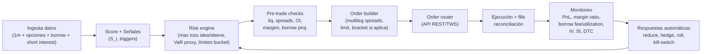

# Estrategia “big short” contra una posible burbuja de IA con pérdida acotada y despliegue en 8–12 semanas

## Resumen ejecutivo

“Big short” **rápido** *y* con **pérdida acotada** no se logra vendiendo acciones “a la mala” (riesgo ilimitado), sino construyendo un **programa de convexidad controlada**: una cartera de **opciones** (puts y spreads) y, opcionalmente, **pares** (long/short) donde la pata corta esté “capada” con opciones. La idea es simple: *si resulta que la burbuja todavía tiene aire para inflarse*, tu pérdida máxima está predefinida y financiable. La parte difícil es operacional: **datos de opciones**, checks de **margen** y (si hay cortos directos) **borrow/locate**, más un monitoreo que reaccione antes de que el mercado te dé una lección práctica de humildad.

Para cumplir el objetivo “lo antes posible”, el blueprint recomendado prioriza:

- **Instrumentos con pérdida máxima fija**: compra de puts, **debit put spreads**, collars (si ya tienes longs), y una capa opcional “crash” (ratio backspreads) con pérdida acotada pero perfil no lineal.
- **Ejecución y compliance desde el día 1**: en entity["country","Estados Unidos","country"], el marco de Regulation SHO impone “locate/borrow” y reglas de close-out ante fails; esto impacta si consideras short stock directo. citeturn4view1turn4view0 En la entity["organization","Unión Europea","supranational union"], el régimen SSR (y su umbral ajustado) define notificaciones de posiciones cortas netas; en entity["country","Chile","country"] existen definiciones explícitas de “venta corta” como venta en bolsa de valores obtenidos en préstamo, y manuales aprobados para operaciones de venta corta/préstamo en bolsas chilenas. citeturn5view0turn3search4
- **Elección del escenario (A/B/C)**: por defecto adopto el escenario **(A) retail en Chile con USD 100k**, porque es el único con jurisdicción implícita (America/Santiago) y capital explícito. Aun así, dejo parametrizado cómo cambia todo en **(B) prop USD 1M** y **(C) institucional USD 50M**.

Esto es un informe técnico/educativo: no es recomendación personalizada ni asesoría legal. Antes de operar opciones, el documento de riesgos de opciones de entity["organization","The Options Clearing Corporation","us options clearinghouse"] es lectura obligada. citeturn1search4turn1search0

## Supuestos y escenarios de despliegue

### Supuestos explícitos (por ausencia de datos del usuario)

- **Escenario por defecto**: (A) retail en entity["country","Chile","country"] con **USD 100k** y tolerancia al riesgo **moderada** (acepta pérdidas acotadas predefinidas; no acepta riesgo ilimitado).  
- **Brokers permitidos**: no especificados. Se prioriza entity["company","Interactive Brokers","brokerage firm"] y entity["company","Saxo Bank","danish investment bank"] (por APIs y cobertura), y se listan corredores locales chilenos como alternativa o puente operativo. citeturn1search2turn2search3turn3search0  
- **Mercado objetivo**: “trade IA” se expresa típicamente vía (i) semiconductores, (ii) hyperscalers, (iii) software “IA high beta” y (iv) ETFs temáticos/índices.  
- **Horizonte**: 8–12 semanas para despliegue inicial; holding típico de posiciones 4–16 semanas (opciones).  
- **Latencia**: no crítica; se trabaja con **barras 1 minuto** + datos de opciones y borrow.  

### Qué cambia entre los escenarios A/B/C

| Dimensión | (A) Retail USD 100k | (B) Prop USD 1M | (C) Institucional USD 50M |
|---|---:|---:|---:|
| Objetivo principal | Convexidad barata y simple | Convexidad + tácticas (pares) | Programa sistemático multi-capa |
| Instrumentos “core” | Puts/put spreads sobre índices/ETFs líquidos | Puts/spreads + overlays single-name | Índices + canastas + OTC opcional |
| Riesgo por idea (máx pérdida) | 0.50%–1.00% NAV | 0.25%–0.50% NAV | 0.05%–0.20% NAV |
| Riesgo total del “sleeve” | 5%–8% NAV | 3%–6% NAV | 1%–3% NAV |
| Complejidad operativa | Baja | Media | Alta (compliance, reporting, ops) |

Los porcentajes son **heurísticos**: se calibran a tu tolerancia real de drawdown y a la volatilidad del mercado (y de la IV).

## Universo objetivo y score cuantitativo para seleccionar activos

### Universo mínimo viable (rápido de implementar)

Divide el universo en 4 “buckets”, para no mezclar peras con GPUs:

1) **Semiconductores / infraestructura IA** (alta beta; opciones líquidas en varios nombres).  
2) **Hyperscalers** (más diversificados; pueden actuar como hedge “menos explosivo”).  
3) **Software/servicios etiquetados IA** (donde suele aparecer el “múltiplo por narrativa”).  
4) **ETFs/índices** (para expresar “burbuja IA” como factor, evitando el riesgo idiosincrático de un solo nombre).

### Variables cuantitativas requeridas (y por qué)

- **Valuación**: EV/Sales, P/FCF (o FCF yield).  
- **Exposición a IA (AI-exposure)**: % ingresos atribuibles a productos/servicios IA (cuando exista), o proxy textual (menciones en filings) / segment reporting.  
- **Crowdedness/squeeze risk**: short interest, days-to-cover (derivado). Para marketwide reporting de short interest en EE. UU., entity["organization","FINRA","us self-regulatory org"] exige reportes dos veces al mes (vista “crowdedness” con retraso). citeturn1search3turn1search7  
- **Costo/viabilidad de short**: borrow fee y disponibilidad. entity["company","Interactive Brokers","brokerage firm"] publica herramientas para ver cantidad disponible, número de lenders y tasa indicativa e histórica; y advierte que el borrow puede subir por oferta/demanda y hasta generar “negative rebate”. citeturn1search5turn1search1  
- **Opciones**: IV (ATM), skew (p.ej., 25Δ put vs 25Δ call), term structure (30d vs 90d).  
- **Liquidez**: volumen, spread, OI de opciones, ADV de subyacente.

### Fórmula de score (robusta y práctica)

Define un score “IA-bubble short candidate” \(S_i\) por activo \(i\) en \([0,100]\). Usa estandarización robusta por MAD (menos sensible a outliers):

- \(Z(x_i)=\dfrac{x_i-\text{mediana}(x)}{1.4826\cdot \text{MAD}(x)}\)

Propuesta de score:

\[
S_i = 100 \cdot \sigma\Big(
0.25 Z(\text{EV/Sales}) +
0.20 Z(\text{P/FCF}) +
0.15 \text{AIExposure} +
0.10 Z(\text{ShortInterest}) +
0.10 Z(\text{DaysToCover}) -
0.10 \text{BorrowPenalty} +
0.10 \text{IVSkew}
\Big)
\]

Donde:

- **AIExposure** en \([0,1]\): 0 = nada, 1 = altamente dependiente de ingresos IA.  
- **BorrowPenalty** en \([0,1]\): p.ej. \(\min(\text{BorrowFee}/20\%, 1)\). (Penaliza shorts imposibles de financiar).  
- **IVSkew**: p.ej. \((IV_{25\Delta put} - IV_{25\Delta call})\) en “vol points”.

### Umbrales sugeridos (para “ir a producción rápido”)

Estos umbrales son *arranque*; se recalibran semanalmente:

- **Candidato fuerte**: \(S_i \ge 70\) y al menos 2 de 3:
  - EV/Sales en el **top decile** del bucket,  
  - P/FCF en el **top decile** o FCF negativo,  
  - AIExposure ≥ **0.30**.
- **Evitar short stock directo** si:
  - Borrow fee > **10% anual** (para holdings de semanas), o
  - Days-to-cover > **7**, o
  - señales de squeeze (subida fuerte + aumento de borrow + noticias).

La razón práctica: el borrow puede volverse prohibitivo y variable; IBKR explicita que los costos pueden elevarse por dinámica de oferta/demanda y llegar a rebate negativo. citeturn1search1turn1search5

## Estructuras preferidas con pérdida acotada y sizing

### Tabla comparativa de estructuras “limit-loss” (recomendadas)

| Estructura | Pérdida máxima | Cuándo usarla | Pros | Contras operativos |
|---|---:|---|---|---|
| **Long put** | Prima pagada | Esperas caída grande/rápida o quieres convexidad pura | Máximo loss fijo; gran convexidad | Theta; IV crush; timing exigente (ODD: entender riesgos) citeturn1search4 |
| **Debit put spread** | Débito neto | Esperas caída moderada; quieres mejor costo/beneficio | Menos prima; define payoff | Capas ganancia; selección de strikes crítica |
| **Collar** (long stock + long put + short call) | Acotada por put | Si ya tienes longs (p.ej., índice) y quieres protección barata | Reduce costo de put vendiendo call | Limita upside; gestión de assignment |
| **Put ratio backspread** (p.ej., -1 put ATM + +2 puts OTM) | Limitada (si se estructura con débito o bajo riesgo) | Buscas “crash convexity” barata | Gran payoff si colapsa fuerte | Zona de pérdida intermedia; requiere gestión y margen por pierna corta |
| **Pair trade** (long “quality” vs short “hype”, capado con calls/puts) | Diseñable | Quieres aislar “factor IA hype” neutralizando beta | Reduce riesgo de mercado | Más complejidad; riesgo de correlación rota |
| **ETF inverso 1x** | Capital invertido | Hedge táctico simple | Operación fácil | Tracking error; no ideal para largo plazo |
| **ETF inverso apalancado** | Capital invertido | Trading muy corto | Potente a 1–2 días | “Reset” diario: desempeño puede divergir fuertemente en horizontes >1 día; riesgo amplificado citeturn2search1turn2search4turn2search9 |

Sobre ETFs inversos/leveraged: el regulador advierte explícitamente que “resetean” diario y que el desempeño en periodos más largos puede diferir significativamente del múltiplo diario, especialmente en mercados volátiles. citeturn2search1turn2search4

### Recomendación por escenario (lo más implementable)

- **(A) Retail USD 100k (default)**  
  Core: **debit put spreads** sobre índice/ETF líquido (beta tech/IA) + una capa pequeña de **long puts** (crash) en vencimientos escalonados (8–16 semanas). Evitar short stock salvo casos muy líquidos y borrow bajo.  
- **(B) Prop USD 1M**  
  Core igual, más: canasta de single-names con **put spreads** + **pares** (long quality / short hype) y gestión de delta.  
- **(C) Institucional USD 50M**  
  Programa de opciones por buckets, overlays de índices, y (si mandato lo permite) estructuras OTC equivalentes; fuerte énfasis en reporting, controles, auditoría.

## Reglas de entrada/salida, señales y gestión de riesgo con ejemplos numéricos A/B/C

### Señales y reglas (fundamentales, técnicas, catalizadores)

**Principio**: no basta “está caro”; necesitas un gatillo. El gatillo puede ser:

- **Técnico**: quiebre de tendencia (p.ej., bajo MA200) + aumento de RV/IV + volumen en caídas.  
- **Fundamental/evento**: earnings con guía débil, recorte de capex esperado, presión competitiva, regulación adversa, o “re-rating” del múltiplo.  
- **Régimen**: subida de tasas reales / stress de liquidez.

### Pseudocódigo de decisión (focus: pérdida acotada)

```text
cada día (o cada hora):
  actualizar datos: precio(1m), cadena_opciones, IV/skew, short_interest, borrow_fee
  para cada activo i en universo:
      score Si = formula_score(i)
      if Si >= 70:
          if trigger_regimen OR trigger_evento OR trigger_tecnico:
              elegir estructura:
                  si IV está muy alta -> preferir debit_put_spread
                  si quieres crash convexity y prima baja -> long_put (pequeño) o backspread controlado
              calcular tamaño con regla de max pérdida por idea
              pasar pre-trade checks (liq, spread, OI, margen, límites portfolio)
              ejecutar con órdenes limit / multileg si aplica
  gestionar:
      si profit >= objetivo o evento se materializa:
          tomar ganancias parcial / rolar strikes
      si drawdown del sleeve >= límite:
          reducir exposición, activar kill-switch
      si IV colapsa y tesis sigue:
          migrar a spreads más baratos (roll down/out)
```

### Reglas de sizing (pérdida máxima por idea y límites de cartera)

Define:

- **Max pérdida por idea** = \(r_{\text{idea}}\cdot NAV\)  
- **Max pérdida total del sleeve** = \(r_{\text{sleeve}}\cdot NAV\)  
- **Límite de concentración** por bucket = p.ej., 40% del sleeve en semis, 40% software, 20% índices/ETFs.

Sugerencias:

| Escenario | \(r_{\text{idea}}\) | \(r_{\text{sleeve}}\) | Stop de sleeve (DD) |
|---|---:|---:|---:|
| (A) 100k | 0.75% (USD 750) | 6% (USD 6,000) | 50% del sleeve (USD 3,000) |
| (B) 1M | 0.40% (USD 4,000) | 4% (USD 40,000) | 35% del sleeve (USD 14,000) |
| (C) 50M | 0.10% (USD 50,000) | 2% (USD 1,000,000) | 30% del sleeve (USD 300,000) |

**Cómo se implementa con opciones**: si compras un spread cuyo débito neto es USD 2.50 por acción (USD 250 por contrato), en (A) el tamaño máximo por idea sería \(\lfloor 750/250 \rfloor = 3\) contratos.

### Margin impact (por qué evitamos short stock directo en “fast launch”)

Con short stock, el margen y los riesgos de liquidación forzada son centrales. IBKR explica conceptos de margen (initial/maintenance) y que deficiencias pueden gatillar liquidación; además, en su material educativo menciona que bajo Regulation T un short sale requiere depósito equivalente a 150% del valor al momento de ejecutarse (100% proceeds + 50% adicional), ilustrando por qué un squeeze puede golpear fuerte el equity. citeturn1search2turn1search9turn1search6

Por rapidez y control de pérdida, el “MVP big short” se apoya en **prima pagada** (puts/spreads) antes que en margen dinámico.

## Implementación operativa en el sistema previo: datos, pre-trade checks, ejecución y brokers

### Datos necesarios y frecuencia (en orden de prioridad)

1) **Precios**: barras 1m para señales y evaluación de fills.  
2) **Cadena de opciones**: strikes/vencimientos, bid/ask, IV, greeks (o aproximaciones). ODD de OCC para riesgos y mecánica de opciones listadas. citeturn1search4turn1search0  
3) **Borrow y disponibilidad** (solo si haces short stock): herramientas como “shortable search” dan tasa indicativa y cantidad disponible / lenders, incluso histórico (útil para stress). citeturn1search5turn1search1  
4) **Short interest**: proxy de crowdedness (con rezago), con régimen de reporte en FINRA en EE. UU. citeturn1search3turn1search7  

### Pre-trade checks (mínimos para no autodestruirte)

- **Liquidez**: spread relativo de opciones (<1–2% del mid en ETFs; <3–5% en single-names), OI mínimo, volumen reciente.  
- **Costo total**: comisión + slippage esperado + (si aplica) borrow fee proyectado. IBKR advierte explícitamente que su página no considera todos los fees, y que borrow rates pueden ser elevados por oferta/demanda. citeturn1search1  
- **Márgenes**: si hay piernas vendidas (spreads/backspreads), verificar requisitos de margen/“excess liquidity”. citeturn1search2turn1search14  
- **Cumplimiento**: si hay short stock en EE. UU., el broker-dealer debe tener “locate/borrow” o grounds razonables, salvo excepciones de market maker; y hay reglas de close-out por fails. citeturn4view1turn4view0

### Flujos de ejecución (Mermaid)



### Tabla de brokers (priorizando IBKR, Saxo y locales Chile)

| Tipo | Broker | Qué aporta para “limit-loss big short” | Evidencia/nota |
|---|---|---|---|
| Global (prioridad) | entity["company","Interactive Brokers","brokerage firm"] | Herramientas de borrow/shortable y costos, info de margen y amplia API para órdenes (placeOrder, order types) | Borrow/shortable search + costos y notas sobre dinámica de oferta/demanda citeturn1search5turn1search1; margen/posibles liquidaciones citeturn1search2; ejemplos y doc de placeOrder citeturn2search6turn2search2turn2search17 |
| Global (prioridad) | entity["company","Saxo Bank","danish investment bank"] | “Precheck” para simular costos/efectos antes de enviar orden; útil para spreads/multileg | Endpoint `/precheck` y multileg precheck documentados citeturn2search0turn2search3turn2search11 |
| Local entity["country","Chile","country"] | Corredores regulados (ej. Renta 4, Banchile, BTG Pactual Chile, etc.) | Pueden servir como acceso local y/o internacional dependiendo del corredor; pero la disponibilidad de derivados/shorting internacional varía por cada entidad y convenio | Listado oficial CMF de corredores vigentes citeturn3search0turn3search7; ejemplo de oferta de acciones internacionales vía Renta 4/Banco Falabella Inversiones citeturn3search9 |

Si tu meta es “lo antes posible” y con opciones, suele ser más directo usar un broker global con opciones integradas y APIs maduras; los corredores locales pueden ser excelentes, pero la **capacidad de opciones/shorting internacional** y los costos exactos deben verificarse corredor por corredor.

### Librerías recomendadas (Python/R) para señal, sizing, ejecución y simulación

| Componente | Python (rápido a prod) | R (research/validación) |
|---|---|---|
| Datos/series | pandas, numpy | data.table, xts |
| Opciones (pricing/greeks) | QuantLib (bindings), py_vollib | RQuantLib |
| Ejecución/REST | requests | httr2 |
| IBKR | ib_insync (wrapper popular) o TWS API oficial (sockets) citeturn2search10turn2search6 | IBrokers (si aplica a tu setup) |
| Backtest rápido | vectorbt / backtrader | quantstrat / PerformanceAnalytics |

(Estas librerías son un stack típico; la selección final depende de tu latencia, gobernanza de modelos y equipo.)

## Backtesting, simulación y stress tests orientados a “pérdida acotada”

### Replay tick vs 1m (qué usar aquí)

Para “latencia no crítica” y despliegue rápido:
- **Replay 1m** para señales y ejecución (modelo de slippage).  
- **Tick** solo si modelas microestructura (generalmente no necesario en el MVP de puts/spreads).

### Modelos mínimos para simular realismo

- **Slippage**: función del spread y liquidez. Ejemplo: slippage = max(0.5*spread, k/volumen).  
- **Opciones**: ejecutar al mid ± fracción del spread; sensibilidad a IV (vega).  
- **Borrow shock** (si short stock): simular salto de borrow fee (p.ej., 2% → 30% anual) y caída de disponibilidad. IBKR recalca que el costo cambia con oferta/demanda. citeturn1search1turn1search21  
- **Gap up +20% overnight**: stress clave para short; incluso con puts/spreads, evalúa pérdida vs prima y posibles ajustes.  
- **IV spike/collapse**: IV sube (crash) o cae (rally/mean reversion). Esto define si conviene put vs spread.

### Métricas de desempeño (con foco en supervivencia)

- Sharpe (con cuidado en estrategias convexas),  
- Max drawdown (del sleeve y total),  
- Hit rate y payoff ratio,  
- **Time-to-profit** (días a break-even),  
- % de ideas que expiran sin valor (esperable en convexidad),  
- “Premium burn rate” mensual (cuánto pagas por el hedge).

### Gráficos recomendados (incluye al menos uno en tu informe operativo)

Para que esto sea “operable” y no solo “bonito”, incluye al menos 1 gráfico (idealmente 2–3):

1) **PnL vs borrow cost** (si hay shorts): línea de PnL y barras/área de costo acumulado.  
2) **PnL vs slippage**: abanico de sensibilidad (0 bps, 10 bps, 25 bps, 50 bps).  
3) **Short interest vs precio**: para detectar escenario de squeeze (cuando la data exista; en EE. UU. hay reporting regular). citeturn1search3  

## Monitoreo en producción: métricas, umbrales y respuestas automáticas

### Métricas obligatorias

- **PnL** (realizado/no realizado) y drawdown del sleeve.  
- **Margin ratio / excess liquidity** (si hay piernas vendidas). citeturn1search2turn1search14  
- **Opciones**: delta/gamma/vega/theta agregados; exposición por vencimiento.  
- **Borrow** (si aplica): borrow fee, disponibilidad, número de lenders (si tu proveedor lo da). citeturn1search5turn1search1  
- **Short interest / days-to-cover** (crowdedness; con rezago). citeturn1search3turn1search7  
- **ETFs inversos** (si se usan): tracking y divergencia vs objetivo diario; recordar “reset” diario. citeturn2search1  

### Umbrales sugeridos y respuestas automáticas (ejemplo)

| Señal de riesgo | Umbral | Respuesta automática |
|---|---:|---|
| DD del sleeve | 30%–50% del budget | Reducir 50% exposición; pausar nuevas entradas 48h |
| Borrow fee | >10% anual | Migrar short stock → puts/spreads o cerrar |
| Margin cushion | <1.2x margen requerido | Reducir piernas vendidas / cerrar peores spreads |
| IV crush post-evento | -30% IV | Tomar ganancias en spreads; evitar rolar puts caros |
| Gap up contra la tesis | +10% día / +20% overnight | Activar kill-switch de shorts directos; mantener solamente estructuras con max loss predefinido |

## Costos y P&L hipotético con sensibilidad, compliance multi-jurisdicción y roadmap 8–12 semanas

### Costos estimados por escenario (rangos orientativos)

| Rubro | (A) 100k retail | (B) 1M prop | (C) 50M inst |
|---|---:|---:|---:|
| Datos (precios + opciones) | 0–300/mes (paquetes broker) | 1k–10k/mes | 25k–250k/mes |
| Infra (nube/monitoreo) | 50–300/mes | 500–5k/mes | 10k–100k/mes |
| Borrow (si short stock) | variable; evitar | variable | variable, pero negociable a escala |
| Staffing | 0–1 FTE (tú + soporte) | 2–5 FTE | 8–20 FTE + compliance |

Son rangos; los costos reales dependen de licencias de datos, mercados, y de si operas todo con broker data o con vendors.

### Tablas de sensibilidad de P&L (ilustrativas)

**Caso base (estructura con pérdida acotada): debit put spreads**  
Supón que el sleeve compra spreads con costo total igual al budget \(r_{\text{sleeve}}\cdot NAV\). En el peor caso, pierdes ese costo (prima). El “mejor caso” depende de strikes/caída.

| Escenario | Budget sleeve | Max pérdida | Comentario |
|---|---:|---:|---|
| (A) | 6% = 6,000 | 6,000 | Pérdida máxima conocida, ideal para “fast launch” |
| (B) | 4% = 40,000 | 40,000 | Permite diversificar buckets y vencimientos |
| (C) | 2% = 1,000,000 | 1,000,000 | Requiere governance de riesgos y reporting |

**Sensibilidad a slippage (sobre prima total)**  
Ejemplo: slippage efectivo sobre primas = 10 bps / 25 bps / 50 bps del notional de prima.

| Slippage | (A) 6,000 | (B) 40,000 | (C) 1,000,000 |
|---:|---:|---:|---:|
| 10 bps | 6 | 40 | 1,000 |
| 25 bps | 15 | 100 | 2,500 |
| 50 bps | 30 | 200 | 5,000 |

Esto muestra por qué “latencia no crítica” no significa “ejecución irrelevante”: en institucional, 50 bps sobre primas puede ser material.

**Si insistes en short stock (no recomendado en MVP): sensibilidad a borrow**  
IBKR advierte que borrow puede ser alto y hasta generar rebate negativo; y su herramienta muestra tasas indicativas y disponibilidad. citeturn1search1turn1search5

Costo aproximado borrow 60 días = Notional × (Borrow anual) × (60/360).

| Borrow anual | Costo 60 días por cada USD 1M short |
|---:|---:|
| 2% | 3,333 |
| 10% | 16,667 |
| 30% | 50,000 |

### Legal y compliance: Chile / UE / EE. UU. (lo mínimo imprescindible)

**EE. UU. (Reg SHO: locate y close-out; naked shorting)**  
La SEC explica que vender en corto sin haber localizado acciones para entrega viola Reg SHO salvo excepciones de market making bona fide, y que Rule 204 exige close-outs ante fails a plazos definidos. citeturn4view0turn4view1

**UE (SSR: notificación de posiciones cortas netas; umbral ajustado)**  
La Comisión ajustó el umbral de notificación relevante mediante el Reglamento Delegado (UE) 2022/27 (aplicación desde 31 enero 2022 según ESMA), estableciendo umbral de 0.1% para notificaciones significativas de NSP en acciones (y escalones posteriores). citeturn7search2turn7search3turn7search4  
En España, la entity["organization","CNMV","spanish securities regulator"] ofrece consulta pública de posiciones cortas publicadas y modelos/soporte de notificación. citeturn7search17turn7search9turn0search10  
En la entity["organization","ESMA","eu securities regulator"] hay páginas y Q&A para implementación del SSR y reporting. citeturn0search1turn0search5

**Chile (definiciones y marco operativo en bolsas)**  
La norma chilena (NCG 187) define “venta corta” como venta en bolsa de valores obtenidos en préstamo, y define préstamo de valores y “vendedor corto” (marco conceptual útil para compliance local). citeturn5view0  
Además, la entity["organization","Comisión para el Mercado Financiero","chile financial market regulator"] publica resoluciones aprobando manuales ligados a venta corta y préstamo de acciones en bolsas chilenas (evidencia de estructura normativa/operativa). citeturn3search4turn0search3  
(En Chile, los detalles de reporting y operativa exacta dependen de la bolsa y del intermediario; para despliegue rápido, valida con tu corredor y la bolsa aplicable.)

### Roadmap operativo 8–12 semanas (milestones, entregables, staffing mínimo)

**Semanas 1–2: Diseño + compliance mínimo**  
Entregables:
- Universo y buckets; especificación de datos (precios 1m + opciones + borrow + short interest).  
- Reglas de score, triggers y sizing (parametrizadas por escenario A/B/C).  
- Checklist legal por jurisdicción (Chile/EEUU/UE si corresponde).

Staffing:
- (A) tú + apoyo técnico puntual  
- (B) 1 quant + 1 engineer + 0.5 ops  
- (C) quant lead + eng lead + risk/compliance + ops

**Semanas 3–4: Backtest + simulación de estrés**  
Entregables:
- Motor de replay 1m, slippage model, IV shock model.  
- Stress tests: +20% gap up, IV spike/collapse, borrow shock.  
- Primer set de gráficos (incluye al menos 1: PnL vs borrow cost o PnL vs slippage).

**Semanas 5–6: Integración broker + paper trading**  
Entregables:
- Conexión API al broker y órdenes multileg (spreads).  
- Pre-trade checks automatizados.  
- Paper trading y reconciliación.

Evidencia:
- En IBKR, órdenes vía `placeOrder` y documentación de order types; en Saxo, `/precheck` para simular sin ejecutar. citeturn2search6turn2search17turn2search3

**Semanas 7–8: Go-live controlado (riesgo pequeño)**  
Entregables:
- Activación con budget de sleeve parcial (p.ej., 25% del budget).  
- Alertas/kill-switch y runbook de incidentes.

**Semanas 9–12: Escalamiento y robustez**  
Entregables:
- Ajuste de umbrales; diversificación por vencimientos (rolling), bucket caps.  
- Auditoría end-to-end (señal→orden→fill) y reportes internos.

## Código de referencia en Python y R (señal, sizing, ejecución, P&L con borrow)

> Snippets educativos, sin credenciales reales. Mantén control de errores, logs y pruebas.

### Python: score + sizing por pérdida máxima (opciones) + simulación simple de carry de borrow

```python
import numpy as np
import pandas as pd

def z_robusto(x: pd.Series) -> pd.Series:
    med = x.median()
    mad = (x - med).abs().median()
    escala = 1.4826 * mad if mad > 0 else 1.0
    return (x - med) / escala

def score_big_short(df: pd.DataFrame) -> pd.Series:
    # df: EVSales, PFCF, AIExposure (0..1), ShortInterest, DaysToCover, BorrowFee (anual, 0..1), IVSkew
    z_evs = z_robusto(df["EVSales"])
    z_pfcf = z_robusto(df["PFCF"])
    z_si = z_robusto(df["ShortInterest"])
    z_dtc = z_robusto(df["DaysToCover"])

    borrow_penalty = np.clip(df["BorrowFee"] / 0.20, 0, 1)  # penaliza >20% anual

    raw = (
        0.25*z_evs +
        0.20*z_pfcf +
        0.15*df["AIExposure"] +
        0.10*z_si +
        0.10*z_dtc -
        0.10*borrow_penalty +
        0.10*df["IVSkew"]
    )
    # función logística para mapear a 0..100
    return 100 * (1 / (1 + np.exp(-raw)))

def size_debit_trade(nav: float, max_loss_pct: float, debit_per_contract: float) -> int:
    # debit_per_contract en USD (p.ej., $250 si el spread cuesta $2.50 * 100)
    max_loss = nav * max_loss_pct
    n = int(max_loss // debit_per_contract)
    return max(n, 0)

def borrow_carry_cost(notional_short: float, borrow_annual: float, days: int) -> float:
    return notional_short * borrow_annual * (days / 360.0)

# Ejemplo rápido
univ = pd.DataFrame({
    "EVSales":[18, 10, 6],
    "PFCF":[120, 55, 25],
    "AIExposure":[0.6, 0.3, 0.1],
    "ShortInterest":[0.08, 0.03, 0.02],
    "DaysToCover":[7, 2, 1],
    "BorrowFee":[0.12, 0.03, 0.01],
    "IVSkew":[0.06, 0.03, 0.01],
}, index=["AI_HYPE","AI_SOFT","HYPERSCALER"])

univ["Score"] = score_big_short(univ)
print(univ.sort_values("Score", ascending=False))

nav = 100000
contracts = size_debit_trade(nav, max_loss_pct=0.0075, debit_per_contract=250)  # 0.75% NAV por idea
print("Contratos (máx por idea):", contracts)

print("Costo borrow 60d por $100k short a 30%:", borrow_carry_cost(100000, 0.30, 60))
```

### R: score + sizing + sensibilidad de P&L a slippage y borrow

```r
z_robusto <- function(x) {
  med <- median(x, na.rm=TRUE)
  mad <- median(abs(x - med), na.rm=TRUE)
  escala <- ifelse(mad > 0, 1.4826 * mad, 1.0)
  (x - med) / escala
}

score_big_short <- function(df) {
  z_evs  <- z_robusto(df$EVSales)
  z_pfcf <- z_robusto(df$PFCF)
  z_si   <- z_robusto(df$ShortInterest)
  z_dtc  <- z_robusto(df$DaysToCover)

  borrow_penalty <- pmin(pmax(df$BorrowFee / 0.20, 0), 1)

  raw <- 0.25*z_evs +
         0.20*z_pfcf +
         0.15*df$AIExposure +
         0.10*z_si +
         0.10*z_dtc -
         0.10*borrow_penalty +
         0.10*df$IVSkew

  100 * (1 / (1 + exp(-raw)))
}

size_debit_trade <- function(nav, max_loss_pct, debit_per_contract) {
  max_loss <- nav * max_loss_pct
  n <- floor(max_loss / debit_per_contract)
  max(0, n)
}

borrow_carry_cost <- function(notional_short, borrow_annual, days) {
  notional_short * borrow_annual * (days / 360)
}

# Sensibilidad PnL: ejemplo simple (delta-1 short) con slippage y borrow
pnl_short_sensitivity <- function(notional, move_pct, slippage_bps, borrow_annual, days) {
  gross <- -notional * move_pct   # si move_pct < 0 (cae), ganancia positiva
  slip  <- notional * (slippage_bps / 10000)
  carry <- borrow_carry_cost(notional, borrow_annual, days)
  gross - slip - carry
}

df <- data.frame(
  EVSales=c(18,10,6),
  PFCF=c(120,55,25),
  AIExposure=c(0.6,0.3,0.1),
  ShortInterest=c(0.08,0.03,0.02),
  DaysToCover=c(7,2,1),
  BorrowFee=c(0.12,0.03,0.01),
  IVSkew=c(0.06,0.03,0.01),
  row.names=c("AI_HYPE","AI_SOFT","HYPERSCALER")
)
df$Score <- score_big_short(df)
df[order(-df$Score), ]

nav <- 100000
contracts <- size_debit_trade(nav, max_loss_pct=0.0075, debit_per_contract=250)
contracts

pnl_short_sensitivity(100000, move_pct=-0.20, slippage_bps=20, borrow_annual=0.30, days=60)
```

### Ejecución REST (pseudocódigo)

Para “lo antes posible”, la ejecución debe soportar:
- órdenes **multileg** (spreads) o secuencia atómica,
- órdenes **limit**,
- idempotencia (para no duplicar),
- y prechecks (si tu broker lo permite; Saxo lo documenta explícitamente). citeturn2search3turn2search0

```text
POST /precheck (opcional) -> valida margen, costos, disponibilidad
si OK:
   POST /orders -> envía spread/orden
   GET /orders/{id} -> monitorea estado
   si fill parcial:
       ajustar o cancelar según reglas
```

---

Si me dices **cuál escenario quieres como real** (A/B/C) y qué broker estás dispuesto a usar (solo IBKR, solo Saxo, o corredor local), puedo aterrizar el plan en una “plantilla operativa” con parámetros cerrados (budgets, strikes, vencimientos, triggers y alertas) usando exactamente el mismo marco de pérdida acotada descrito arriba.