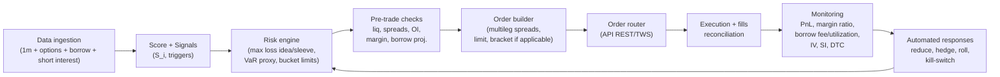

# "Big short" strategy against a possible AI bubble with bounded loss and deployment in 8–12 weeks

## Executive summary

A **fast** *and* **bounded-loss** big short is not achieved by selling shares outright (unlimited risk), but by building a **controlled-convexity program**: a portfolio of **options** (puts and spreads) and, optionally, **pairs** (long/short) where the short leg is "capped" with options. The idea is simple: *if the bubble still has room to inflate*, your maximum loss is predefined and financeable. The hard part is operational: **options data**, **margin** checks, and (if using direct shorts) **borrow/locate**, plus monitoring that reacts before the market gives you a practical lesson in humility.

To meet the "as soon as possible" objective, the recommended blueprint prioritizes:

- **Instruments with a fixed maximum loss**: long puts, **debit put spreads**, collars (if you already hold longs), and an optional "crash" layer (ratio backspreads) with bounded loss but a non-linear profile.
- **Execution and compliance from day 1**: in entity["country","United States","country"], the Regulation SHO framework imposes "locate/borrow" and close-out rules for fails; this matters if you consider direct short stock. citeturn4view1turn4view0 In the entity["organization","European Union","supranational union"], the SSR regime (and its adjusted threshold) governs notifications of net short positions; in entity["country","Chile","country"] there are explicit definitions of "short sale" as the sale on an exchange of securities obtained through a loan, along with approved manuals for short-selling/lending operations on Chilean exchanges. citeturn5view0turn3search4
- **Choice of scenario (A/B/C)**: by default I adopt scenario **(A) retail in Chile with USD 100k**, because it is the only one with an implied jurisdiction (America/Santiago) and explicit capital. Nonetheless, I leave parameterized how everything changes under **(B) prop USD 1M** and **(C) institutional USD 50M**.

This is a technical/educational report: it is not a personalized recommendation or legal advice. Before trading options, the options risk document published by entity["organization","The Options Clearing Corporation","us options clearinghouse"] is required reading. citeturn1search4turn1search0

## Assumptions and deployment scenarios

### Explicit assumptions (in the absence of user data)

- **Default scenario**: (A) retail in entity["country","Chile","country"] with **USD 100k** and **moderate** risk tolerance (accepts predefined bounded losses; does not accept unlimited risk).  
- **Permitted brokers**: not specified. Priority is given to entity["company","Interactive Brokers","brokerage firm"] and entity["company","Saxo Bank","danish investment bank"] (for APIs and coverage), with local Chilean brokers listed as an alternative or operational bridge. citeturn1search2turn2search3turn3search0  
- **Target market**: "AI trade" is typically expressed via (i) semiconductors, (ii) hyperscalers, (iii) "AI high-beta" software, and (iv) thematic ETFs/indices.  
- **Horizon**: 8–12 weeks for initial deployment; typical holding period of 4–16 weeks (options).  
- **Latency**: not critical; working with **1-minute bars** + options and borrow data.  

### What changes across scenarios A/B/C

| Dimension | (A) Retail USD 100k | (B) Prop USD 1M | (C) Institutional USD 50M |
|---|---:|---:|---:|
| Primary objective | Cheap and simple convexity | Convexity + tactical (pairs) | Systematic multi-layer program |
| Core instruments | Puts/put spreads on liquid indices/ETFs | Puts/spreads + single-name overlays | Indices + baskets + optional OTC |
| Risk per idea (max loss) | 0.50%–1.00% NAV | 0.25%–0.50% NAV | 0.05%–0.20% NAV |
| Total "sleeve" risk | 5%–8% NAV | 3%–6% NAV | 1%–3% NAV |
| Operational complexity | Low | Medium | High (compliance, reporting, ops) |

The percentages are **heuristics**: they are calibrated to your actual drawdown tolerance and to market volatility (and IV).

## Target universe and quantitative score for asset selection

### Minimum viable universe (fast to implement)

Divide the universe into 4 "buckets," to avoid mixing apples with GPUs:

1) **Semiconductors / AI infrastructure** (high beta; liquid options on several names).  
2) **Hyperscalers** (more diversified; can act as a "less explosive" hedge).  
3) **AI-labeled software/services** (where the "narrative multiple" tends to appear).  
4) **ETFs/indices** (to express "AI bubble" as a factor, avoiding idiosyncratic risk from a single name).

### Required quantitative variables (and why)

- **Valuation**: EV/Sales, P/FCF (or FCF yield).  
- **AI exposure**: % of revenues attributable to AI products/services (when available), or a textual proxy (mentions in filings) / segment reporting.  
- **Crowdedness/squeeze risk**: short interest, days-to-cover (derived). For market-wide short interest reporting in the U.S., entity["organization","FINRA","us self-regulatory org"] requires reports twice a month (a lagged "crowdedness" view). citeturn1search3turn1search7  
- **Short cost/viability**: borrow fee and availability. entity["company","Interactive Brokers","brokerage firm"] publishes tools to see the quantity available, number of lenders, and indicative and historical rates; and warns that borrow can rise with supply/demand dynamics and even generate a "negative rebate." citeturn1search5turn1search1  
- **Options**: IV (ATM), skew (e.g., 25Δ put vs 25Δ call), term structure (30d vs 90d).  
- **Liquidity**: volume, spread, options OI, underlying ADV.

### Score formula (robust and practical)

Define an "AI-bubble short candidate" score \(S_i\) per asset \(i\) in \([0,100]\). Use robust standardization via MAD (less sensitive to outliers):

- \(Z(x_i)=\dfrac{x_i-\text{median}(x)}{1.4826\cdot \text{MAD}(x)}\)

Proposed score:

\[
S_i = 100 \cdot \sigma\Big(
0.25 Z(\text{EV/Sales}) +
0.20 Z(\text{P/FCF}) +
0.15 \text{AIExposure} +
0.10 Z(\text{ShortInterest}) +
0.10 Z(\text{DaysToCover}) -
0.10 \text{BorrowPenalty} +
0.10 \text{IVSkew}
\Big)
\]

Where:

- **AIExposure** in \([0,1]\): 0 = none, 1 = highly dependent on AI revenues.  
- **BorrowPenalty** in \([0,1]\): e.g. \(\min(\text{BorrowFee}/20\%, 1)\). (Penalizes shorts that are impossible to finance).  
- **IVSkew**: e.g. \((IV_{25\Delta put} - IV_{25\Delta call})\) in vol points.

### Suggested thresholds (for "going to production quickly")

These thresholds are *starting points*; they are recalibrated weekly:

- **Strong candidate**: \(S_i \ge 70\) and at least 2 of 3:
  - EV/Sales in the **top decile** of the bucket,  
  - P/FCF in the **top decile** or negative FCF,  
  - AIExposure ≥ **0.30**.
- **Avoid direct short stock** if:
  - Borrow fee > **10% per year** (for multi-week holdings), or
  - Days-to-cover > **7**, or
  - Squeeze signals (sharp rally + rising borrow + news).

The practical reason: borrow can become prohibitive and variable; IBKR explicitly states that costs can rise due to supply/demand dynamics and reach a negative rebate. citeturn1search1turn1search5

## Preferred structures with bounded loss and sizing

### Comparative table of "limit-loss" structures (recommended)

| Structure | Maximum loss | When to use it | Pros | Operational cons |
|---|---:|---|---|---|
| **Long put** | Premium paid | Expecting a large/fast drop or wanting pure convexity | Fixed max loss; great convexity | Theta; IV crush; tight timing (ODD: understand risks) citeturn1search4 |
| **Debit put spread** | Net debit | Expecting a moderate drop; want better cost/benefit | Less premium; defines payoff | Capped gain; critical strike selection |
| **Collar** (long stock + long put + short call) | Bounded by put | If you already hold longs (e.g., index) and want cheap protection | Reduces put cost by selling call | Limits upside; assignment management |
| **Put ratio backspread** (e.g., -1 ATM put + +2 OTM puts) | Limited (if structured with a debit or low risk) | Seeking cheap "crash convexity" | Large payoff if it collapses hard | Intermediate loss zone; requires management and margin for the short leg |
| **Pair trade** (long "quality" vs short "hype," capped with calls/puts) | Designable | Want to isolate "AI hype factor" while neutralizing beta | Reduces market risk | More complexity; broken-correlation risk |
| **Inverse ETF 1x** | Capital invested | Simple tactical hedge | Easy to trade | Tracking error; not ideal for the long run |
| **Leveraged inverse ETF** | Capital invested | Very short-term trading | Powerful at 1–2 days | Daily "reset": performance can diverge sharply over horizons >1 day; amplified risk citeturn2search1turn2search4turn2search9 |

On inverse/leveraged ETFs: the regulator explicitly warns that they "reset" daily and that performance over longer periods can differ significantly from the stated daily multiple, especially in volatile markets. citeturn2search1turn2search4

### Recommendation by scenario (most implementable)

- **(A) Retail USD 100k (default)**  
  Core: **debit put spreads** on a liquid index/ETF (tech/AI beta) + a small layer of **long puts** (crash) in staggered expirations (8–16 weeks). Avoid short stock except in highly liquid cases with low borrow.  
- **(B) Prop USD 1M**  
  Same core, plus: a basket of single names with **put spreads** + **pairs** (long quality / short hype) and delta management.  
- **(C) Institutional USD 50M**  
  Options program by bucket, index overlays, and (if the mandate allows) equivalent OTC structures; strong emphasis on reporting, controls, and audit.

## Entry/exit rules, signals, and risk management with numerical examples A/B/C

### Signals and rules (fundamental, technical, catalysts)

**Principle**: "it's expensive" is not enough; you need a trigger. The trigger can be:

- **Technical**: trend break (e.g., below MA200) + increase in RV/IV + volume on down days.  
- **Fundamental/event**: earnings with weak guidance, expected capex cut, competitive pressure, adverse regulation, or multiple "re-rating."  
- **Regime**: rising real rates / liquidity stress.

### Decision pseudocode (focus: bounded loss)

```text
each day (or each hour):
  update data: price(1m), options_chain, IV/skew, short_interest, borrow_fee
  for each asset i in universe:
      score Si = formula_score(i)
      if Si >= 70:
          if trigger_regime OR trigger_event OR trigger_technical:
              choose structure:
                  if IV is very high -> prefer debit_put_spread
                  if crash convexity desired and low premium -> long_put (small) or controlled backspread
              calculate size using max-loss-per-idea rule
              run pre-trade checks (liq, spread, OI, margin, portfolio limits)
              execute with limit orders / multileg if applicable
  manage:
      if profit >= target or event materializes:
          take partial profits / roll strikes
      if sleeve drawdown >= limit:
          reduce exposure, activate kill-switch
      if IV collapses and thesis holds:
          migrate to cheaper spreads (roll down/out)
```

### Sizing rules (maximum loss per idea and portfolio limits)

Define:

- **Max loss per idea** = \(r_{\text{idea}}\cdot NAV\)  
- **Max total sleeve loss** = \(r_{\text{sleeve}}\cdot NAV\)  
- **Concentration limit** per bucket = e.g., 40% of sleeve in semis, 40% software, 20% indices/ETFs.

Suggestions:

| Scenario | \(r_{\text{idea}}\) | \(r_{\text{sleeve}}\) | Sleeve stop (DD) |
|---|---:|---:|---:|
| (A) 100k | 0.75% (USD 750) | 6% (USD 6,000) | 50% of sleeve (USD 3,000) |
| (B) 1M | 0.40% (USD 4,000) | 4% (USD 40,000) | 35% of sleeve (USD 14,000) |
| (C) 50M | 0.10% (USD 50,000) | 2% (USD 1,000,000) | 30% of sleeve (USD 300,000) |

**How it is implemented with options**: if you buy a spread whose net debit is USD 2.50 per share (USD 250 per contract), in (A) the maximum size per idea would be \(\lfloor 750/250 \rfloor = 3\) contracts.

### Margin impact (why we avoid direct short stock in "fast launch")

With short stock, margin and forced-liquidation risks are central. IBKR explains the concepts of initial/maintenance margin and that deficiencies can trigger liquidation; additionally, in its educational material it notes that under Regulation T a short sale requires a deposit equal to 150% of the value at execution (100% proceeds + 50% additional), illustrating why a squeeze can hit equity hard. citeturn1search2turn1search9turn1search6

For speed and loss control, the "MVP big short" relies on **premium paid** (puts/spreads) rather than dynamic margin.

## Operational implementation in the existing system: data, pre-trade checks, execution, and brokers

### Required data and frequency (in order of priority)

1) **Prices**: 1m bars for signals and fill evaluation.  
2) **Options chain**: strikes/expirations, bid/ask, IV, Greeks (or approximations). OCC ODD for risks and mechanics of listed options. citeturn1search4turn1search0  
3) **Borrow and availability** (only if doing short stock): tools such as "shortable search" provide indicative rates and quantity available / lenders, including historical data (useful for stress testing). citeturn1search5turn1search1  
4) **Short interest**: crowdedness proxy (with lag), with FINRA reporting regime in the U.S. citeturn1search3turn1search7  

### Pre-trade checks (minimum required to avoid self-destruction)

- **Liquidity**: relative options spread (<1–2% of mid for ETFs; <3–5% for single names), minimum OI, recent volume.  
- **Total cost**: commission + expected slippage + (if applicable) projected borrow fee. IBKR explicitly warns that its page does not account for all fees and that borrow rates can be elevated by supply/demand dynamics. citeturn1search1  
- **Margins**: if there are short legs (spreads/backspreads), verify margin requirements / "excess liquidity." citeturn1search2turn1search14  
- **Compliance**: if there is short stock in the U.S., the broker-dealer must have "locate/borrow" or reasonable grounds, except for market-maker exemptions; and there are close-out rules for fails. citeturn4view1turn4view0

### Execution flows (Mermaid)



### Broker table (prioritizing IBKR, Saxo, and local Chile brokers)

| Type | Broker | What it provides for "limit-loss big short" | Evidence/note |
|---|---|---|---|
| Global (priority) | entity["company","Interactive Brokers","brokerage firm"] | Borrow/shortable tools and costs, margin info, and broad API for orders (placeOrder, order types) | Borrow/shortable search + costs and notes on supply/demand dynamics citeturn1search5turn1search1; margin/possible liquidations citeturn1search2; examples and placeOrder docs citeturn2search6turn2search2turn2search17 |
| Global (priority) | entity["company","Saxo Bank","danish investment bank"] | `/precheck` endpoint to simulate costs/effects before submitting an order; useful for spreads/multileg | `/precheck` and multileg precheck endpoints documented citeturn2search0turn2search3turn2search11 |
| Local entity["country","Chile","country"] | Regulated brokers (e.g., Renta 4, Banchile, BTG Pactual Chile, etc.) | Can serve as local and/or international access depending on the broker; but international derivatives/shorting availability varies by entity and agreement | Official CMF list of active brokers citeturn3search0turn3search7; example of international equities offering via Renta 4/Banco Falabella Inversiones citeturn3search9 |

If your goal is "as soon as possible" and with options, it is generally more straightforward to use a global broker with integrated options and mature APIs; local brokers can be excellent, but **international options/shorting capability** and exact costs must be verified broker by broker.

### Recommended libraries (Python/R) for signal, sizing, execution, and simulation

| Component | Python (fast to prod) | R (research/validation) |
|---|---|---|
| Data/series | pandas, numpy | data.table, xts |
| Options (pricing/Greeks) | QuantLib (bindings), py_vollib | RQuantLib |
| Execution/REST | requests | httr2 |
| IBKR | ib_insync (popular wrapper) or official TWS API (sockets) citeturn2search10turn2search6 | IBrokers (if applicable to your setup) |
| Quick backtest | vectorbt / backtrader | quantstrat / PerformanceAnalytics |

(These libraries represent a typical stack; the final selection depends on your latency requirements, model governance, and team.)

## Backtesting, simulation, and stress tests oriented toward "bounded loss"

### Tick replay vs 1m (what to use here)

For "non-critical latency" and fast deployment:
- **1m replay** for signals and execution (slippage model).  
- **Tick** only if modeling microstructure (generally not needed in the puts/spreads MVP).

### Minimum models for realistic simulation

- **Slippage**: function of spread and liquidity. Example: slippage = max(0.5*spread, k/volume).  
- **Options**: execute at mid ± fraction of spread; sensitivity to IV (vega).  
- **Borrow shock** (if short stock): simulate a borrow fee jump (e.g., 2% → 30% per year) and drop in availability. IBKR emphasizes that cost changes with supply/demand. citeturn1search1turn1search21  
- **Gap up +20% overnight**: key stress for shorts; even with puts/spreads, evaluate loss vs premium and possible adjustments.  
- **IV spike/collapse**: IV rises (crash) or falls (rally/mean reversion). This determines whether a put or spread is more appropriate.

### Performance metrics (with focus on survival)

- Sharpe (with care in convex strategies),  
- Max drawdown (of sleeve and total),  
- Hit rate and payoff ratio,  
- **Time-to-profit** (days to break-even),  
- % of ideas that expire worthless (expected in convexity strategies),  
- Monthly "premium burn rate" (how much you pay for the hedge).

### Recommended charts (include at least one in your operational report)

To make this "operational" rather than just "pretty," include at least 1 chart (ideally 2–3):

1) **PnL vs borrow cost** (if there are shorts): PnL line and bars/area of accumulated cost.  
2) **PnL vs slippage**: sensitivity fan (0 bps, 10 bps, 25 bps, 50 bps).  
3) **Short interest vs price**: to detect squeeze scenarios (when data is available; in the U.S. there is regular reporting). citeturn1search3  

## Production monitoring: metrics, thresholds, and automated responses

### Required metrics

- **PnL** (realized/unrealized) and sleeve drawdown.  
- **Margin ratio / excess liquidity** (if there are short legs). citeturn1search2turn1search14  
- **Options**: aggregated delta/gamma/vega/theta; exposure by expiration.  
- **Borrow** (if applicable): borrow fee, availability, number of lenders (if your provider supplies it). citeturn1search5turn1search1  
- **Short interest / days-to-cover** (crowdedness; with lag). citeturn1search3turn1search7  
- **Inverse ETFs** (if used): tracking and divergence vs daily target; remember the daily "reset." citeturn2search1  

### Suggested thresholds and automated responses (example)

| Risk signal | Threshold | Automated response |
|---|---:|---|
| Sleeve DD | 30%–50% of budget | Reduce exposure by 50%; pause new entries 48h |
| Borrow fee | >10% per year | Migrate short stock → puts/spreads or close |
| Margin cushion | <1.2x required margin | Reduce short legs / close worst spreads |
| IV crush post-event | -30% IV | Take profits on spreads; avoid rolling expensive puts |
| Gap up against thesis | +10% day / +20% overnight | Activate kill-switch on direct shorts; keep only structures with predefined max loss |

## Costs and hypothetical P&L with sensitivity, multi-jurisdiction compliance, and 8–12 week roadmap

### Estimated costs by scenario (indicative ranges)

| Item | (A) 100k retail | (B) 1M prop | (C) 50M inst |
|---|---:|---:|---:|
| Data (prices + options) | 0–300/month (broker packages) | 1k–10k/month | 25k–250k/month |
| Infrastructure (cloud/monitoring) | 50–300/month | 500–5k/month | 10k–100k/month |
| Borrow (if short stock) | variable; avoid | variable | variable, but negotiable at scale |
| Staffing | 0–1 FTE (you + support) | 2–5 FTE | 8–20 FTE + compliance |

These are ranges; actual costs depend on data licenses, markets, and whether you operate entirely on broker data or with vendors.

### P&L sensitivity tables (illustrative)

**Base case (bounded-loss structure): debit put spreads**  
Assume the sleeve buys spreads with total cost equal to the budget \(r_{\text{sleeve}}\cdot NAV\). In the worst case, you lose that cost (premium). The "best case" depends on strikes/decline.

| Scenario | Sleeve budget | Max loss | Comment |
|---|---:|---:|---|
| (A) | 6% = 6,000 | 6,000 | Known maximum loss, ideal for "fast launch" |
| (B) | 4% = 40,000 | 40,000 | Allows diversification across buckets and expirations |
| (C) | 2% = 1,000,000 | 1,000,000 | Requires risk governance and reporting |

**Sensitivity to slippage (on total premium)**  
Example: effective slippage on premiums = 10 bps / 25 bps / 50 bps of premium notional.

| Slippage | (A) 6,000 | (B) 40,000 | (C) 1,000,000 |
|---:|---:|---:|---:|
| 10 bps | 6 | 40 | 1,000 |
| 25 bps | 15 | 100 | 2,500 |
| 50 bps | 30 | 200 | 5,000 |

This shows why "non-critical latency" does not mean "execution is irrelevant": at institutional scale, 50 bps on premiums can be material.

**If you insist on short stock (not recommended in MVP): borrow sensitivity**  
IBKR warns that borrow can be high and even generate a negative rebate; and its tool shows indicative rates and availability. citeturn1search1turn1search5

Approximate borrow cost for 60 days = Notional × (Annual borrow) × (60/360).

| Annual borrow | 60-day cost per USD 1M short |
|---:|---:|
| 2% | 3,333 |
| 10% | 16,667 |
| 30% | 50,000 |

### Legal and compliance: Chile / EU / U.S. (the essential minimum)

**U.S. (Reg SHO: locate and close-out; naked shorting)**  
The SEC explains that selling short without having located shares for delivery violates Reg SHO except for bona fide market-making exemptions, and that Rule 204 requires close-outs for fails within defined timeframes. citeturn4view0turn4view1

**EU (SSR: notification of net short positions; adjusted threshold)**  
The Commission adjusted the relevant notification threshold through Delegated Regulation (EU) 2022/27 (application from 31 January 2022 per ESMA), establishing a 0.1% threshold for significant notifications of NSP in shares (with subsequent escalation steps). citeturn7search2turn7search3turn7search4  
In Spain, entity["organization","CNMV","spanish securities regulator"] provides a public consultation of published short positions and notification models/support. citeturn7search17turn7search9turn0search10  
At entity["organization","ESMA","eu securities regulator"] there are pages and Q&A for SSR implementation and reporting. citeturn0search1turn0search5

**Chile (definitions and operational framework on exchanges)**  
The Chilean regulation (NCG 187) defines "short sale" as the sale on an exchange of securities obtained through a loan, and defines securities lending and "short seller" (a useful conceptual framework for local compliance). citeturn5view0  
Additionally, entity["organization","Comisión para el Mercado Financiero","chile financial market regulator"] publishes resolutions approving manuals linked to short selling and share lending on Chilean exchanges (evidence of a regulatory/operational structure). citeturn3search4turn0search3  
(In Chile, the exact reporting details and operational mechanics depend on the exchange and the intermediary; for fast deployment, validate with your broker and the applicable exchange.)

### Operational roadmap 8–12 weeks (milestones, deliverables, minimum staffing)

**Weeks 1–2: Design + minimum compliance**  
Deliverables:
- Universe and buckets; data specification (1m prices + options + borrow + short interest).  
- Score rules, triggers, and sizing (parameterized by scenario A/B/C).  
- Legal checklist by jurisdiction (Chile/U.S./EU as applicable).

Staffing:
- (A) you + occasional technical support  
- (B) 1 quant + 1 engineer + 0.5 ops  
- (C) quant lead + eng lead + risk/compliance + ops

**Weeks 3–4: Backtest + stress simulation**  
Deliverables:
- 1m replay engine, slippage model, IV shock model.  
- Stress tests: +20% gap up, IV spike/collapse, borrow shock.  
- First set of charts (include at least 1: PnL vs borrow cost or PnL vs slippage).

**Weeks 5–6: Broker integration + paper trading**  
Deliverables:
- API connection to broker and multileg orders (spreads).  
- Automated pre-trade checks.  
- Paper trading and reconciliation.

Evidence:
- In IBKR, orders via `placeOrder` and order types documentation; in Saxo, `/precheck` to simulate without executing. citeturn2search6turn2search17turn2search3

**Weeks 7–8: Controlled go-live (small risk)**  
Deliverables:
- Activation with a partial sleeve budget (e.g., 25% of budget).  
- Alerts/kill-switch and incident runbook.

**Weeks 9–12: Scaling and robustness**  
Deliverables:
- Threshold adjustment; diversification by expiration (rolling), bucket caps.  
- End-to-end audit (signal→order→fill) and internal reports.

## Reference code in Python and R (signal, sizing, execution, P&L with borrow)

> Educational snippets, without real credentials. Maintain error handling, logs, and tests.

### Python: score + sizing by maximum loss (options) + simple borrow carry simulation

```python
import numpy as np
import pandas as pd

def z_robust(x: pd.Series) -> pd.Series:
    med = x.median()
    mad = (x - med).abs().median()
    scale = 1.4826 * mad if mad > 0 else 1.0
    return (x - med) / scale

def score_big_short(df: pd.DataFrame) -> pd.Series:
    # df: EVSales, PFCF, AIExposure (0..1), ShortInterest, DaysToCover, BorrowFee (annual, 0..1), IVSkew
    z_evs = z_robust(df["EVSales"])
    z_pfcf = z_robust(df["PFCF"])
    z_si = z_robust(df["ShortInterest"])
    z_dtc = z_robust(df["DaysToCover"])

    borrow_penalty = np.clip(df["BorrowFee"] / 0.20, 0, 1)  # penalizes >20% per year

    raw = (
        0.25*z_evs +
        0.20*z_pfcf +
        0.15*df["AIExposure"] +
        0.10*z_si +
        0.10*z_dtc -
        0.10*borrow_penalty +
        0.10*df["IVSkew"]
    )
    # logistic function to map to 0..100
    return 100 * (1 / (1 + np.exp(-raw)))

def size_debit_trade(nav: float, max_loss_pct: float, debit_per_contract: float) -> int:
    # debit_per_contract in USD (e.g., $250 if the spread costs $2.50 * 100)
    max_loss = nav * max_loss_pct
    n = int(max_loss // debit_per_contract)
    return max(n, 0)

def borrow_carry_cost(notional_short: float, borrow_annual: float, days: int) -> float:
    return notional_short * borrow_annual * (days / 360.0)

# Quick example
univ = pd.DataFrame({
    "EVSales":[18, 10, 6],
    "PFCF":[120, 55, 25],
    "AIExposure":[0.6, 0.3, 0.1],
    "ShortInterest":[0.08, 0.03, 0.02],
    "DaysToCover":[7, 2, 1],
    "BorrowFee":[0.12, 0.03, 0.01],
    "IVSkew":[0.06, 0.03, 0.01],
}, index=["AI_HYPE","AI_SOFT","HYPERSCALER"])

univ["Score"] = score_big_short(univ)
print(univ.sort_values("Score", ascending=False))

nav = 100000
contracts = size_debit_trade(nav, max_loss_pct=0.0075, debit_per_contract=250)  # 0.75% NAV per idea
print("Contracts (max per idea):", contracts)

print("Borrow cost 60d on $100k short at 30%:", borrow_carry_cost(100000, 0.30, 60))
```

### R: score + sizing + P&L sensitivity to slippage and borrow

```r
z_robust <- function(x) {
  med <- median(x, na.rm=TRUE)
  mad <- median(abs(x - med), na.rm=TRUE)
  scale <- ifelse(mad > 0, 1.4826 * mad, 1.0)
  (x - med) / scale
}

score_big_short <- function(df) {
  z_evs  <- z_robust(df$EVSales)
  z_pfcf <- z_robust(df$PFCF)
  z_si   <- z_robust(df$ShortInterest)
  z_dtc  <- z_robust(df$DaysToCover)

  borrow_penalty <- pmin(pmax(df$BorrowFee / 0.20, 0), 1)

  raw <- 0.25*z_evs +
         0.20*z_pfcf +
         0.15*df$AIExposure +
         0.10*z_si +
         0.10*z_dtc -
         0.10*borrow_penalty +
         0.10*df$IVSkew

  100 * (1 / (1 + exp(-raw)))
}

size_debit_trade <- function(nav, max_loss_pct, debit_per_contract) {
  max_loss <- nav * max_loss_pct
  n <- floor(max_loss / debit_per_contract)
  max(0, n)
}

borrow_carry_cost <- function(notional_short, borrow_annual, days) {
  notional_short * borrow_annual * (days / 360)
}

# P&L sensitivity: simple example (delta-1 short) with slippage and borrow
pnl_short_sensitivity <- function(notional, move_pct, slippage_bps, borrow_annual, days) {
  gross <- -notional * move_pct   # if move_pct < 0 (falls), positive gain
  slip  <- notional * (slippage_bps / 10000)
  carry <- borrow_carry_cost(notional, borrow_annual, days)
  gross - slip - carry
}

df <- data.frame(
  EVSales=c(18,10,6),
  PFCF=c(120,55,25),
  AIExposure=c(0.6,0.3,0.1),
  ShortInterest=c(0.08,0.03,0.02),
  DaysToCover=c(7,2,1),
  BorrowFee=c(0.12,0.03,0.01),
  IVSkew=c(0.06,0.03,0.01),
  row.names=c("AI_HYPE","AI_SOFT","HYPERSCALER")
)
df$Score <- score_big_short(df)
df[order(-df$Score), ]

nav <- 100000
contracts <- size_debit_trade(nav, max_loss_pct=0.0075, debit_per_contract=250)
contracts

pnl_short_sensitivity(100000, move_pct=-0.20, slippage_bps=20, borrow_annual=0.30, days=60)
```

### REST execution (pseudocode)

For "as soon as possible," execution must support:
- **multileg** orders (spreads) or an atomic sequence,
- **limit** orders,
- idempotency (to avoid duplication),
- and prechecks (if your broker supports it; Saxo documents this explicitly). citeturn2search3turn2search0

```text
POST /precheck (optional) -> validates margin, costs, availability
if OK:
   POST /orders -> submits spread/order
   GET /orders/{id} -> monitors status
   if partial fill:
       adjust or cancel according to rules
```

---

If you tell me **which scenario you want as real** (A/B/C) and which broker you are willing to use (IBKR only, Saxo only, or a local broker), I can nail down the plan into an "operational template" with closed parameters (budgets, strikes, expirations, triggers, and alerts) using exactly the same bounded-loss framework described above.
